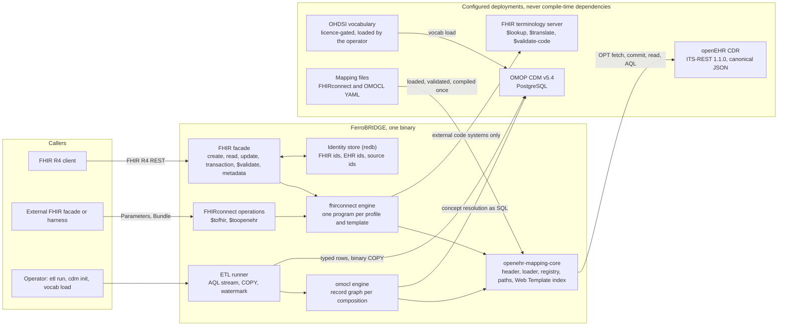
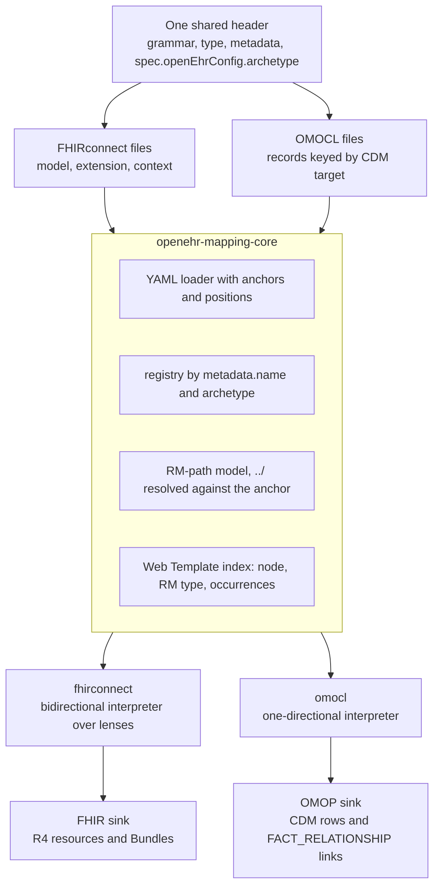
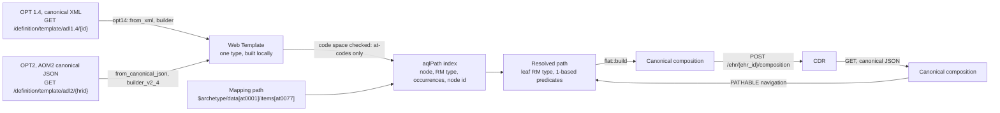
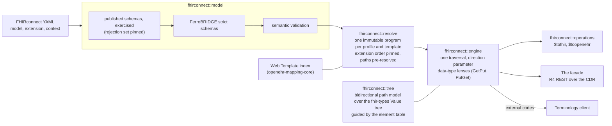
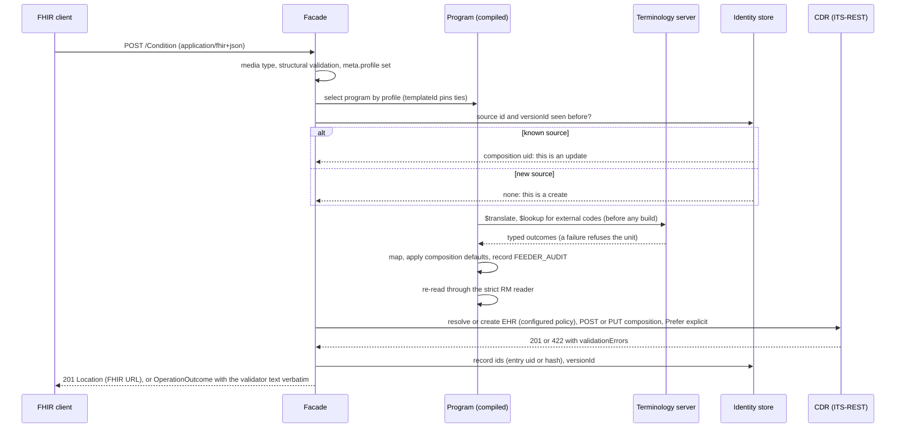
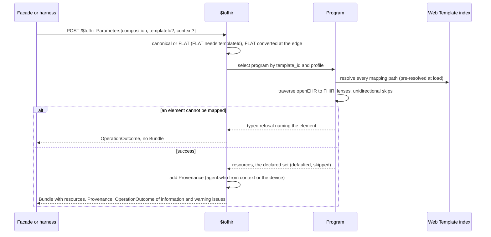
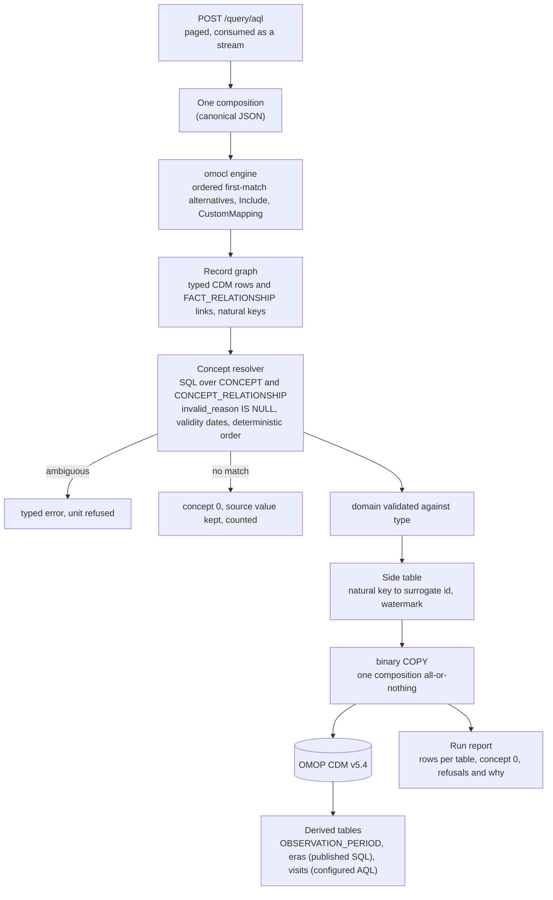
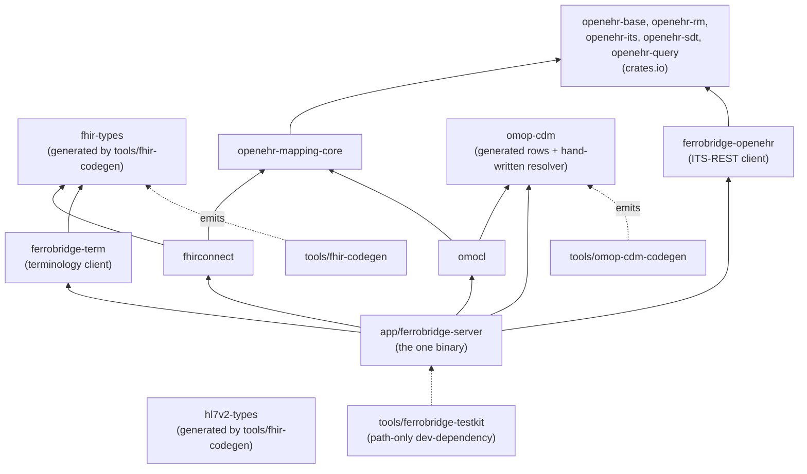
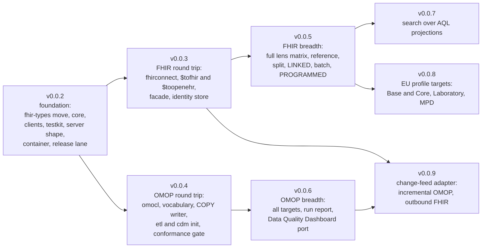

<!-- SPDX-FileCopyrightText: Vernum Projecten B.V. -->
<!-- SPDX-License-Identifier: BUSL-1.1 -->

# Architecture

FerroBRIDGE is a standalone bridge between openEHR and two interoperability
targets: HL7 FHIR, driven by the FHIRconnect specification, and the OMOP Common
Data Model, driven by the OMOCL specification. It runs beside an openEHR CDR
that it reaches only over the openEHR ITS-REST API. This document is the design
of record. It is the output of three research passes over the primary sources,
on 2026-09-03, 2026-09-05 and 2026-09-12, whose full reports are recorded on
issue #1. Every decision below names its ground. Where a specification is
silent, the decision is labelled as FerroBRIDGE's own. Where a specification
contradicts itself or another specification, the contradiction is named and
carried as an `upstream-report` issue.

The third pass re-read every pin and both sibling servers a week after the
second, and changed seven things:

1. **The FHIR model move has not started, and its premise moved.** The
   sibling terminology server still generates and publishes `fhir-types`; the
   crate went from 0.1.43 to 0.1.97 in the week, has no cargo features, keeps
   a lexical-precision `Value` of its own instead of `serde_json::Value`, and
   its element table is an XML-codec input without cardinality. The decision
   to move stands; its scope is restated in section 4.1 and section 10, and
   the crate line floor is re-baselined.
2. **FHIRconnect is growing a REST API.** A draft chapter (specification pull
   request #93, open since 2026-08-20) defines `$tofhir` and `$toopenehr` as
   FHIR operations, and the reference engine implements it (openFHIR 3.0.0,
   2026-09-04). FerroBRIDGE adopts the draft as its engine surface beside the
   facade (section 4.7), pinned by commit and labelled draft.
3. **The identity recommendation is changing upstream.** Pull request #94
   replaces "a hash of the Composition UID and the Entry Path" with
   `LOCATABLE.uid` of the entries. Section 9 takes the entry `uid` first and
   keeps the hash as the fallback.
4. **The reference engine moved under the design.** openFHIR 3.0.0 rewrote
   condition evaluation (plural keys, OR semantics across target attributes),
   preserves time-zone offsets, always emits `Provenance`, reports partial
   results as `OperationOutcome` warnings, and invents two extension URLs for
   `DV_PROPORTION`. Section 4.4 records what FerroBRIDGE takes and what it
   refuses.
5. **The CDR's own FHIR connector is retiring into this project.** The
   reference CDR decided (its issue #3080) to remove its in-tree FHIR
   connector once FerroBRIDGE ships its first round trip. Section 12 is the
   carry-over register: every decided behaviour, test invariant and known
   defect of that connector, with a disposition, so nothing is lost silently
   and nothing wrong is copied.
6. **The profile targets have a name.** The EHDS regulation fixes six
   priority categories; the HL7 Europe implementation guides are the current
   proxy for their exchange format, all on FHIR R4, and the FHIRconnect
   library already carries one EEHRxF context. Section 4.8 sets the planned
   targets and their order; the reference CDR's decision to author no profile
   mapping (its issue #3206) is inherited here, where the mappings belong.
7. **The pins moved where the crates did.** The `openehr-*` crates are at
   0.0.69 (0.0.65 to 0.0.67 changed only the copyright holder in every
   source header; 0.0.68 split the Simplified Data Template engines out of
   `openehr-its` into `openehr-sdt`, and 0.0.69 is the first lockstep publish
   of the nine); the specification corpora did not move (every pinned commit is
   still the head of its default branch); OMOP CDM v5.5.0 shipped and stays
   tracked, never assumed; Eos, the OMOCL reference engine, has had no commit
   since 2026-03-09.

Sections 2, 4, 6, 9, 10, 12, 13, 14 and 15 carry the changes.

## 0. The picture

The bridge is one process beside a CDR. Everything it reads or writes crosses
one of five edges, and no clinical data rests inside it.



The change-feed adapter (section 5.1) is a sixth edge that arrives later, as
FerroBRIDGE's own extension.

## 1. The two specifications are two languages

FHIRconnect and OMOCL are written by the same author and share one header
(`grammar`, `type`, `metadata.name` and `metadata.version`, `spec` with
`spec.openEhrConfig.archetype`; the FHIRconnect header page states the header
"is standardized for both FHIRconnect and OMOCL"). Below the header they share
RM paths, archetype-keyed model files, an include mechanism (`slotArchetype`
in FHIRconnect, `Include` in OMOCL), an external-code escape hatch
(`mappingCode`, `CustomMapping`) and a code-translation concept (`conceptmap`,
`conceptMap`). Both also use a `../` parent step inside a path. That step is
the mapping languages' own operator: the openEHR path grammar (BASE Release
1.2.0 §Paths and Locators, <https://specifications.openehr.org/releases/BASE/Release-1.2.0/architecture_overview.html#_paths_and_locators>)
defines absolute paths, relative paths, predicates and the XPath `//` pattern,
and no parent step. FHIRconnect's claim that "`../` is used in openEHR" is
unsupported and is reported upstream. The engine resolves `../` against the
mapping's anchor before any path reaches a CDR.

Nothing else is common:

- **FHIRconnect** (<https://sevkohler.github.io/FHIRconnect-spec/build/site/FHIRconnect/v1.0.0/index.html>)
  is bidirectional. A mapping is a tree of entries pairing a FHIR path with an
  openEHR path (`with`), typed from the instances, with `followedBy` nesting
  that concatenates paths onto the parent, AND-combined conditions applied to
  the input side only, `manual` literals, `reference` resources, `hierarchy`
  realignment and `unidirectional` markers. Three file types: `model`
  (archetype to unprofiled resource, the shared layer), `extension`
  (profile and template adaptation, executed after the model), `context` (the
  entry point: profile, template, archetypes, extensions, `start`).
- **OMOCL** (<https://github.com/SevKohler/OMOCL>) is unidirectional openEHR to
  OMOP by construction. A mapping is a flat list of records, each keyed by a
  `type` naming a CDM target (`Measurement`, `ConditionOccurrence`, `Person`,
  seven more) or one of two structural types (`Include`, `CustomMapping`).
  A record's keys are OMOCL's own column vocabulary (`concept_id`, `value`,
  `unit`, `measurement_date`, `gender_concept`), each taking ordered
  `alternatives` of an RM `path`, a literal `code` (an OMOP `concept_id`; `0`
  is the CDM's "no matching concept"), an inline `conceptMap`, or a
  `multiplication`, plus `optional`. The projection from an OMOCL key to CDM
  columns (`value` to `value_as_number`, `unit` to `unit_concept_id`,
  `concept_id` to `measurement_concept_id` and `measurement_source_concept_id`)
  is stated nowhere in OMOCL; four of the ten targets have a published syntax
  table, and the library is the only evidence for the rest. The published
  files use YAML anchors and aliases (57 of 208 files define one).

**Decision:** one shared foundation, two interpreters, two sinks. A single
intermediate representation over both grammars would be the union of two
dissimilar languages and would be wrong the first time either specification
moved. The second pass confirmed the split from the other side: the OMOCL
library's semantics (ordered first-match alternatives, a five-attribute
projection out of one `DV_QUANTITY` node, dates taken from an enclosing
context) have no counterpart in FHIRconnect, and FHIRconnect's recurrence
model has none in OMOCL.



## 2. Pinned versions

The pins live in `docs/VERSIONS.md`; this table records the ground for each.
A corpus is pinned by commit, never by a moving tag or a `latest` URL. Every
corpus commit below was re-checked on 2026-09-12 and is still the head of its
default branch.

| Component | Pin | Ground |
|---|---|---|
| FHIRconnect | v1.0.0 (specification source `SevKohler/FHIRconnect-spec` at `195b07fdb4c78da0432fdd1e9dbd127b81be6165` (2026-07-22); `model-mapping.schema.json` sha256 `6a925151c029e10ef11ccfc2eaafbbf441eea97ffec8ea9e0cd0b8493871d852`; `contextual-mapping.schema.json` sha256 `a96d600dfa7faacb1b2d8919a20554bed5699a636efd7f903d601b71cae15832`) | the only released version; both published draft-07 schemas are the machine-readable half of the authority and are vendored verbatim from the rendered v1.0.0 site (`build/site/FHIRconnect/v1.0.0/_attachments/`, the bytes the hashes name); the repository source at the same commit carries newer copies (a `unidirectional` and an `operational` property) that are vendored beside them as evidence of movement, never as the pin; the published schemas are defective in seven places (section 4.2), so they are exercised as evidence, never as the sole validator |
| FHIRconnect REST API (draft) | specification pull request #93, head `2bf2a2fe91bae2ae659cda1665826567ea81b4af` (`engine/rest-api.adoc`, the `ToFhir` and `ToOpenEhr` FSH operation definitions) | an unmerged chapter the reference engine already implements (openFHIR 3.0.0); FerroBRIDGE implements it as a draft, pinned by commit, and re-adjudicates on merge (section 4.7) |
| FHIRconnect mapping library | `SevKohler/FHIRconnect-mapping-lib` at `6bd4c19a2f96821c04fbeed3c6f6c190fd85825b` (2026-06-05), 107 YAML mapping files (52 `model`, 55 `projects`) | the conformance corpus, never an oracle: 24 files fail the published schema, 5 cross-references dangle, 6 files share one `metadata.name`; the 12 German KDS contexts pin profile version 2025.0.0 and every module has moved past it; the one EEHRxF context pins Laboratory 0.1.1 against a published 2.0.0 and declares a `sem_ver` its own OPT contradicts (section 4.8) |
| FHIR | R4 (4.0.1), package `hl7.fhir.r4.core` 4.0.1 (CC0) | the only value the FHIRconnect schemas admit for `spec.version`; the mapping library targets R4; every EHDS-category HL7 Europe guide has an R4 line (section 4.8) |
| OMOCL | v1.0.0 (grammar `OMOCL/v1.0.0`; corpus `SevKohler/OMOCL` at `c082db8ed81a062a574a2c058366045f600c2ed7`, 2026-09-19, 208 files, Apache-2.0) | the only released grammar. The git tag `v1.0.0` carries pre-grammar files headed `engine: EOS/v0.0.62`; the grammar string first appears at tag `v1.0.1`, so the corpus is pinned by commit. No JSON schema is published; the grammar is two railroad images and four syntax tables |
| OMOP CDM | v5.4 (`OHDSI/CommonDataModel` tag `v5.4.3`, 2026-08-04; licence Apache License 2.0 per `DESCRIPTION`, the repository has no `LICENSE` file) | the only version OMOCL files declare (`spec.system: OMOP`, `spec.version: 5.4`) and the only one the reference engine supports; the CSV table and field definitions and the rendered PostgreSQL DDL are the machine-readable input. v5.5.0 shipped 2026-08-25 and is tracked, never assumed |
| HL7 v2-to-FHIR guide | `hl7.fhir.uv.v2mappings` 1.0.0 (FHIR 4.0.1; package CC0-1.0, repository `HL7/v2-to-fhir` Apache-2.0, tag `1.0.0` at `873b331b`) | the machine-readable v2-to-R4 corpus (263 ConceptMaps) the HL7 v2 face executes (#251); vendored as the sixth FHIR package (#252) |
| HL7 v2 definitions | `HL7/v2ig` `input/sourceOfTruth` at `3adcdbfff654ccbff5cd33aa34bd909a087e8e19` (1694 files, v2.9.1-derived logical StructureDefinitions; no LICENSE, the v2+ page licenses copying "for internal purposes only") | the generator input for the v2 message-structure table (#253); fetched at build time into an ignored directory and never committed, per the redistribution rule; the owner holds the HL7 membership condition |
| openEHR ITS-REST | 1.1.0 (OpenAPI at `openEHR/specifications-ITS-REST` tag `Release-1.1.0`, commit `24058992`; each document declares CC-BY-ND-3.0 in `info.license` while the repository's `LICENSE` file is Apache-2.0, both recorded in the provenance; modules EHR, Query and Definition, `STABLE`) | the released REST API a conformant CDR speaks; Admin and Demographic are `x-status: DEVELOPMENT` in the same release and the bridge does not depend on them; every tagged OAS file says `info.version: latest`, so provenance records tag and blob |
| `openehr-base` | 0.0.69 (minor line 0.0; Apache-2.0) | the RM foundation types, including partial ISO 8601 dates (section 3); the line moved from 0.0.61 to 0.0.64 between passes and to 0.0.69 on 2026-09-24 with no change to the surfaces named here |
| `openehr-rm` | 0.0.69 (Apache-2.0) | the RM 1.1.0 model, its canonical JSON codec and the BASE path parser |
| `openehr-its` | 0.0.69 (Apache-2.0) | the ITS wire layer: the OPT 1.4 codec, the canonical JSON and XML codecs, the ITS-REST 1.1.0 data types; the bridge takes `default-features = false` with `opt14`, `json` and `rest-server` |
| `openehr-sdt` | 0.0.69 (BUSL-1.1) | the Simplified Data Template engines split out of `openehr-its` at 0.0.68: the Web Template builder, the FLAT and STRUCTURED codecs, the composition builder (`flat::build`) and the RM-instance validation (`rm_instance`); the bridge takes `default-features = false` with `flat`, leaving the `moka` cache out |
| `openehr-query` | 0.0.69 (BUSL-1.1) | the AQL 1.1.0 parser and canonical printer. `openehr-term` (Apache-2.0 AND CC-BY-SA-3.0) and `openehr-lang` arrive transitively |
| `openehr-am` | 0.0.69 (Apache-2.0) | the generated AM 2.4 model: the AOM2 `OPERATIONAL_TEMPLATE` and `ARCHETYPE_HRID` types an ADL 2 template decodes into (section 3); taken directly because the bridge names those types |
| `openehr-adl` | not taken in the first cut (0.0.69, BUSL-1.1) | the ADL 2 text parser, flattener and OPT2 generator; the bridge fetches an ADL 2 template as AOM2 canonical JSON, so it never parses ADL source (section 3); taken later only if a CDR serves ADL 2 templates as text alone |
| `fhir-types` | 0.1.106 (the line starts one patch above the sibling terminology server's 0.1.97 of 2026-09-12 and moves with every change to the packaged content) | the FHIR model, generated here by `tools/fhir-codegen` from the vendored HL7 packages (section 4.1); the crate and its generator now live here and the sibling consumes the crate from crates.io |
| openFHIR, the FHIRconnect reference engine | 3.0.1 (2026-09-09), read for behaviour only | never an oracle; section 4.4 records the 3.0.0 behaviour changes and what the bridge takes |
| Eos, the OMOCL reference engine | 0.0.62 (2024-03-20), last commit 2026-03-09 | never an oracle; dormant, so its behaviour is prior art with no expected movement |
| FHIR terminology operations | R4, R4B tolerant | `CodeSystem/$lookup`, `ConceptMap/$translate`, `ValueSet/$validate-code`; a server may answer R4 or R4B; the reference server selects the version by path (section 6) |

**Profile packages, the mapping targets.** No profile package is pinned for
codegen; each is pinned as the target a context mapping names, and
`docs/VERSIONS.md` gains a row per package the moment a context targeting it
is authored. The candidates, read 2026-09-12, are in section 4.8.

## 3. The openEHR side

FHIRconnect and OMOCL paths are RM and archetype paths
(`$archetype/data[at0001]/items[at0077]`), never FLAT paths. A path alone is
not executable: leaf RM types, occurrence limits and template node identifiers
come from the **Web Template** built from the template's OPT. The ordered
dependency is OPT, then Web Template, then path resolution, then composition.



**What the openEHR crates provide, verified in the 0.0.64 sources and re-read at 0.0.69.**
`openehr-its` parses OPT 1.4 (`opt14`) and carries the canonical JSON and XML
codecs; `openehr-sdt` (split out of it at 0.0.68) builds the Web Template in
the Better and EHRbase shape (`tree`, `id`, `rmType`, `aqlPath`, `inputs`),
converts between FLAT, STRUCTURED and canonical JSON, and builds a canonical
composition from a set of path and value pairs (`flat::build`). `openehr-rm`
carries the RM 1.1.0 model with its canonical JSON codec and the BASE path
parser with PATHABLE navigation (`v1_2::paths`). `openehr-query` parses and
prints AQL 1.1.0. `openehr-its` also carries the ITS-REST 1.1.0 request and
response types generated from the vendored OpenAPI.

**What the bridge writes itself.** Three things the crates do not export: an
`aqlPath` index over the Web Template with leaf RM type resolution, the
parent-to-child relative path derivation (the crate keeps its own copy
private), and the HTTP client (the crates generate data types and server
traits, no client).

**Both template generations are supported: ADL 1.4 (OPT 1.4) and ADL 2 (the
AM 2.4 line: AOM2, OPT2).** Owner requirement, 2026-09-12. The ITS-REST 1.1.0
Definition API serves both (<https://specifications.openehr.org/releases/ITS-REST/Release-1.1.0/definition.html>),
and the Simplified Formats specification defines a Web Template as "a
processed representation of an openEHR Operational Template" without naming a
generation, which is the seam the design stands on. The two paths meet at one
type:

| Generation | Fetch | Body | Decode | Build |
|---|---|---|---|---|
| ADL 1.4 | `GET /definition/template/adl1.4/{template_id}` with `Accept: application/xml` | the canonical OPT 1.4 XML | `openehr_its::opt14::from_xml` | `openehr_its::flat::webtemplate::builder::build_web_template` |
| ADL 2 | `GET /definition/template/adl2/{template_id}` with `Accept: application/json` | `OperationalTemplateV2`, which the OpenAPI leaves as an empty object schema and the reference CDR fills with AOM2 canonical JSON (`_type: OPERATIONAL_TEMPLATE`) | `openehr_its::json::from_canonical_json` into `openehr_am::v2_4::aom2::archetype::operational_template::OperationalTemplate` | `openehr_its::flat::webtemplate::builder_v2_4::build_web_template_v2_4` |

Both builders return the same `WebTemplate` type and run the same compaction,
in-context synthesis and node-id passes, so everything downstream (the
`aqlPath` index, relative paths, composition build and read) is
generation-blind. The rules around the seam, each with its ground:

- **Resolution order is `adl1.4` then `adl2`, on the one `template_id` a
  composition carries.** A canonical composition's `archetype_details` names
  a template by string with no generation marker, and the reference CDR
  resolves the same way (its OPT 1.4 store first, its ADL 2 store on a miss).
  A `404` or `406` from one route means "try the other"; a miss on both is the
  typed unknown-template error.
- **The ADL 2 request never accepts `text/plain` and never sends
  `application/xml` alone.** The OpenAPI enumerates `application/json`,
  `application/xml` and `text/plain` in `Accept` but declares bodies only for
  `text/plain` (ADL 2 source) and `application/json`; the reference CDR lets
  `text/plain` win whenever it is acceptable and answers `406` to XML alone.
  Consuming ADL 2 source would cost the `openehr-adl` parser, its flattener
  and an archetype repository for `create_opt`; the JSON form is the OPT2 the
  server already compiled. A server whose `application/json` body is not AOM2
  canonical JSON is a typed refusal naming the body's `_type`, never a guess.
- **Identifiers.** An ADL 2 template is an `ARCHETYPE_HRID` with a full
  three-part version and an optional namespace
  (`org.highmed::openEHR-EHR-COMPOSITION.t_vital_signs.v1.0.0`); a partial
  id resolves to the latest matching major version, and the bridge caches
  under the resolved id, never under what it asked for: the `ETag` when it
  parses as an HRID (the reference CDR's behaviour), else the template's own
  `archetype_id` (the OpenAPI's `ETag` example is a UUID, reported on #104). The
  Web Template's `templateId` carries the full HRID with namespace, its root
  `nodeId` and every `aqlPath` predicate carry the interface form (`.v1`, no
  namespace), and `semVer` is the release version for ADL 2 and absent for
  ADL 1.4; the generation is decided by which fetch succeeded, never by that
  field. Mapping files that key on `$archetype` use the interface form.
- **The node-id code space is checked before any path resolves.** ADL 2.4
  admits at-codes and id-codes, and states that "the at-code coding system
  must be used for systems that need to be conformant to the openEHR
  Reference Model" (<https://specifications.openehr.org/releases/AM/Release-2.4.0/ADL2.html>,
  §ADL 2.4); the reference corpus and the reference CDR's 1.4-to-2 converter
  produce id-codes all the same. FHIRconnect and OMOCL paths are written with
  at-codes, and the ADL 2 builder copies node ids verbatim and reads no
  `alternative_ids`, so an at-coded path does not resolve against an id-coded
  template. The bridge inspects the built Web Template and refuses an
  id-coded template with a diagnostic naming the template and the code space.
  An at-to-id translation from `C_OBJECT.alternative_ids` is a later,
  separately decided unit, never a silent fallback.
- **Two deltas the engines must not trip over.** A term binding's `value` is
  a code for ADL 1.4 and a URI for ADL 2, and constraint (`ac`) bindings exist
  only on the 1.4 side, so the lens that reads bindings switches on the
  generation the Web Template records; and the ADL 2 builder's structural
  conformance walk is empty, so the bridge's own composition validation before
  commit (section 12) carries more weight for ADL 2 templates than for 1.4.
  No specification governs the reconciliation of the two generations: AM 2.4
  has no "AOM 1.4 to AOM2" mapping document, so each rule above is
  FerroBRIDGE's own and is labelled so in code.

**The Web Template is built locally, never fetched.** The crate's builder-side
`WebTemplate` type serialises and does not deserialise (still true at 0.0.64;
the generated ITS-REST `definition::WebTemplate` type does deserialise, but it
is the OpenAPI schema shape, not the builder's model, and carries no `inputs`
resolution), and ITS-REST 1.1.0 defines a Web Template representation
(`application/openehr.wt+json`) for the `adl1.4` route only, none for `adl2`,
so a fetched Web Template could never cover both generations. This is also
the safer path: the FLAT node-id uniqueness rule in the Simplified Formats
specification does not fix sibling order, so two conformant servers can name
the same node differently, and a bridge that regenerated node ids against a
foreign Web Template would mis-key values. The reference CDR does serve
`application/openehr.wt+json` for ADL 1.4; the bridge does not depend on it.

**The wire is canonical JSON.** Canonical JSON is the mandatory composition
representation in ITS-REST 1.1.0; FLAT and STRUCTURED are optional. The
mapping engines resolve paths against the canonical RM tree (the approach the
OMOCL reference engine takes, in 56 lines against 534 for the FLAT route in the
FHIRconnect reference engine), build the composition with the crate's builder,
and commit and read canonical JSON. FLAT never crosses the CDR wire. The one
place FLAT appears is the FHIRconnect REST API (section 4.7), which requires an
engine to accept and emit both serialisations; the crate's converters cover
that at the edge. Two index bases meet here and must never be confused: RM
positional predicates are 1-based (BASE §Paths and Locators), FLAT `:n`
indices are 0-based.

**The ITS-REST surface the bridge consumes:** `POST /ehr`,
`GET /ehr?subject_id=&subject_namespace=`, `GET /ehr/{ehr_id}`;
`POST /ehr/{ehr_id}/composition`, `PUT /ehr/{ehr_id}/composition/{versioned_object_uid}`
with `If-Match`, `GET /ehr/{ehr_id}/composition/{uid_based_id}`;
`POST /ehr/{ehr_id}/contribution` for atomic multi-object commits;
`POST /query/aql`; `GET /definition/template/adl1.4/{template_id}` and
`GET /definition/template/adl2/{template_id}`
(<https://specifications.openehr.org/releases/ITS-REST/Release-1.1.0/ehr.html>,
<https://specifications.openehr.org/releases/ITS-REST/Release-1.1.0/query.html>,
<https://specifications.openehr.org/releases/ITS-REST/Release-1.1.0/definition.html>).
Four facts of that surface shape the client: `Prefer` is always sent
explicitly, because the specification warns its default may change;
`If-Match` carries the bare quoted `version_uid` and the `W/` the `ETag`
carries is stripped; `DELETE` reports a concurrency failure as `409` where
`PUT` reports `412`; and `GET …?version_at_time=` answers `204` for a deleted
composition, which the client surfaces as a typed "deleted" outcome, never as
an absent value. The commit metadata headers (`openehr-version`,
`openehr-audit-details`, `openehr-template-id`, the 1.1.0 names; the overview's
deprecation table maps the older `openEHR-VERSION`, `openEHR-AUDIT_DETAILS`
and `openEHR-TEMPLATE_ID` onto them) exist only in the prose and are absent
from the OpenAPI; the client sends them from the prose and the gap is reported
upstream. The reference CDR accepts both the 1.1.0 value-carrying form and the
deprecated path-in-name form; the client sends the 1.1.0 form only.

Composition-level fields have no FHIR counterpart. FHIRconnect requires the
`start` mapping to slot a reusable `COMPOSITION.<archetype>.<Resource>` mapping
in and recommends defaults for composer, `context/start_time`, `setting`,
`language`, `territory` and `category`
(<https://sevkohler.github.io/FHIRconnect-spec/build/site/FHIRconnect/v1.0.0/engine/defaults-for-fields.html>).
The defaults are deployment configuration, never engine constants (the
reference engine hard-codes `territory=DE`), and every defaulted value is
recorded in the composition's `FEEDER_AUDIT`, which the RM defines for exactly
this case (RM Common §FEEDER_AUDIT).

## 4. The FHIR side

The FHIR side is a pipeline with one compile step and one interpreter, and
two callers of that interpreter.



### 4.1 The FHIR model

The first pass recorded that the published `fhir-types` crate "already carries
per-version FHIR types" for the facade. It does not. The crate carries the
terminology root set (`CodeSystem`, `ValueSet`, `ConceptMap`,
`TerminologyCapabilities`, `CapabilityStatement`, `Bundle`, `Parameters`,
`OperationOutcome`) and the closure of datatypes they reference, with a strict
codec (unknown properties refused, lexical primitives kept, choice types
handled). It has no `Condition`, `Observation`, `Patient` or any other clinical
resource.

**Decision (owner, 2026-09-05, re-baselined 2026-09-12): `fhir-types` and its
generator move into this repository, and the bridge generates the shared FHIR
model.** The third pass found the move not started on either side and the
crate's facts changed under the decision. The restated scope:

- **The crate line floor follows the sibling's latest release.** The sibling
  published nine releases after 0.1.43 and is at 0.1.97; the first publish
  from here is the next patch above whatever it last shipped, and the sibling
  freezes its `fhir-types` bumps the day this repository publishes (its issue
  #300 is the sibling's half of the move and is blocked on that first
  publish). Every day of delay widens the gap, so the move is the first unit
  of the foundation release (section 14).
- **Cargo features are new work, because the crate has none.** All four
  version modules (`r4`, `r4b`, `r5`, `r6`) compile unconditionally today.
  The move adds per-version features, a `terminology` feature that reproduces
  today's root set, and a `resources` feature that widens the declared root
  set to every `kind: resource` StructureDefinition per package (146 in R4)
  with its complete closure, default off, so the sibling's switch to
  `default-features = false` shrinks its build instead of growing it.
- **The element table is new work, because what exists serves the XML codec.**
  The crate exposes per-version `Schemas` (`TypeSchema`, `FieldSchema` with
  `name`, `kind`, `many: bool`) sorted by name for the XML codec. A
  path-driven engine needs `min` and `max`, the element path, the choice
  suffix table and `contentReference`. The generator already lowers a
  `Cardinality` and discards it at `many = card == Many`; the move emits it
  as public, documented API.
- **The `Value` entry point is an adapter, not a replacement.** The second
  pass asked for a `serde_json::Value` codec; the sibling has since moved the
  crate off `serde_json::Value` to its own lexical-precision `Value` (its
  issue #483: a decimal must round-trip byte-identically, and
  `arbitrary_precision` was being forced on every dependent). That reason is
  the bridge's reason too. The bridge's path model works over the crate's
  `Value`; a fallible `serde_json::Value` conversion exists at the HTTP edge
  only.
- **The licence boundary is recorded, not assumed.** The crate is Apache-2.0
  in the sibling (generated from CC0 packages) inside a BUSL-1.1 repository,
  and this repository's rule is that code is never copied between the
  siblings because each is its own Licensed Work. Moving the crate is the
  owner's decision and the moved crate keeps Apache-2.0; `docs/VERSIONS.md`
  and `NOTICE` record it as the one first-party crate under a different
  licence, and `scripts/checks/versions.sh` is taught the exception in the
  same change.
- **The vendored packages cost 379 MB.** Five HL7 packages with provenance.
  They are fetched by a committed script with checksum verification; whether
  they are committed or fetched on demand in CI is decided in the move issue
  on the measured clone cost, never by leaving provenance out.

The ground for the move is unchanged: the bridge is the crate's widest
consumer and will drive its evolution from here on, the sibling's needs are
eight resources and a stable set of operation contracts, and the reference CDR
also plans to decode its terminology wire through the crate's R4B module (its
issue #3085), so three servers consume one generated model. Rejected: widening
the crate in place in the sibling (closed as not planned there); a separate
repository for the crate (refused by the owner); the `fhir` crate (146 R4
resources, one author, a five-way licence disjunction, and the owner's own
read of its code quality); `fhir-model` 0.13.0 (R4B and R5 oriented, no
element table; the reference CDR's connector used it and is dropping it);
`helios-fhir` 0.2.1; every FHIRPath evaluator as a model source.

`fhir-terminology` is struck from the design. It is a terminology server over
a code-system provider seam and its manifest pulls in the SNOMED, ICD-11 and
RxNorm loaders and the concept store. The client contracts the bridge speaks
(`CodeSystemLookupRequest`, `ConceptMapTranslate*`, `ValueSetValidateCode*`,
with `from_parameters` and `to_parameters`) live in `fhir-types::r4::operations`.

### 4.2 The mapping files: how a FHIRconnect file is validated

The published schemas are defective in ways that matter. The model schema sets
`additionalProperties: false` on a mapping and omits `mappingCode`, `link`,
`participationsFunction` and mapping-level `conceptmap`, so three of the eight
concept-type mappings the prose defines (PROGRAMMED, LINKED, PARTICIPATION)
cannot appear in a schema-valid file, and 24 of the 107 library files fail
their own schema. `manual` is typed as an array with object `properties` and no
`items`, so it validates nothing. `hierarchy.split.openehr` sits outside
`properties` and is unvalidated. The `type` enum sits at mapping level where no
file writes it; every file writes `type` inside `with`, where the schema leaves
it a free string. `operator` and `unidirectional` have no enum. Conditions are
documented as an array ("Notice that the condition is an array") and typed as
an object. The context schema makes `profile.url` and `profile.version`
optional strings with no format, while the prose calls the profile URL list
plural and the schema holds one. Each is an `upstream-report` issue.

**Decision:** the AST is hand-written Rust, and validation is three layers:

1. **The published schemas, vendored verbatim and exercised.** A test validates
   every corpus file against them and pins the exact set the schemas reject.
   That test is the durable record of the contradiction; it passes when the
   published schema still rejects what the prose allows, and it fails the day
   upstream fixes the schema, which is the signal to re-adjudicate.
2. **FerroBRIDGE's own strict schemas** for both file types, authored from the
   prose plus the published schema, closed (`additionalProperties: false` at
   every level, enums for `operator`, `unidirectional`, `extension`, the
   data-type `type` inside `with`), offered upstream. Every corpus file either
   validates or carries an adjudicated skip naming the defect.
3. **Semantic validation the schema cannot express:** `targetRoot` resolves to
   the same node as `with`; `criteria` is absent for `empty` and `not empty`
   and present otherwise; `slotArchetype`, `spec.extends`,
   `context.archetypes`, `context.extensions` and `context.start` each name a
   loaded `metadata.name`, and `appendTo` names a mapping of the extended
   model by its `name`, a dotted `parent.child` for a nested one
   (`extension-mapping.adoc` §Append); `metadata.name` is unique across the
   loaded set;
   `extension` methods appear only in `type: extension` files; `openehr:
   "$reference"` is mandatory on a `reference` mapping; `mappingCode` names a
   registered function; every path resolves against the Web Template or the
   FHIR element table at load. A file that fails any of these is refused with a
   diagnostic carrying file, YAML path, mapping name and model path.

Rejected: a schema-derived AST (the schema is too defective to derive from,
and it would inherit the `manual` and `hierarchy` holes); validating against
the published schema alone (22.4% of the corpus would be refused, including
the model mapping the first round trip uses).

**Keyword casing is an adjudication, recorded on the tracker.** The library
spells `unidirectional` values four ways (21 of 50 uses are not the documented
`openehr->fhir` and `fhir->openehr`) and the first-milestone model mapping
writes `$openEHRRoot` four times where the specification writes
`$openehrRoot`. The specification's own text is inconsistent in the same way
(`openEHRCondition` beside `openehrCondition`, `openEHR:` beside `openehr:`),
so "spec-exact case" is undefined by the source. YAML keys stay exact, because
the schema fixes them. Keyword values (variables, `unidirectional` values) are
compared case-insensitively, a value outside the documented set is refused, and
a test asserts both spellings pass and a third is refused. This is
FerroBRIDGE's own decision on a specification contradiction, reported upstream
with the library fixes it implies.

**Condition keys are plural, and the singular forms are accepted as aliases.**
The schema documents `targetAttributes` and `criterias` as arrays with OR
semantics across attributes; the reference engine evaluated only the first
attribute until 3.0.0 and carried singular `targetAttribute` and `criteria`
fields it has now removed, normalising the singular spelling at load. The
bridge's AST accepts both spellings, evaluates every attribute with OR, and a
test pins that a two-attribute condition matches on the second.

**A document-root `unidirectional` is refused; `spec.unidirectional` is the
documented form.** The published model schema defines `unidirectional` under
`spec` (`model-mapping.schema.json`, and `basics/main.adoc` §Direction), and
the bridge accepts it there as the file-wide default. The reference engine
also accepts the key at the document root (its 2.2.5 release); no pinned
schema defines that placement, and a closed root rejects it. The bridge
refuses it with a diagnostic naming the schema, so a corpus file that depends
on the engine extension is a recorded defect, never a silent pass.

### 4.3 Context resolution: one immutable program per (profile, template)

A context mapping plus its model mappings and extensions is compiled once into
an immutable program, validated in full at load, then interpreted per request.
The reference engine rebuilds its helper trees per composition and loads
extensions in database result order, so two runs can apply extensions in a
different order; nothing in the specification says which order is right. The
database literature (Kersten et al., PVLDB 2018, doi:10.14778/3275366.3284966)
finds neither compiled nor interpreted execution dominates, so the bridge takes
the separable win: lower once, interpret many.

**The ordering and collision rules, FerroBRIDGE's own where the specification
is silent:**

- Extensions apply in the order `context.extensions` declares them; within an
  extension, in file order. The compiler is a pure function of the file set.
- `add` appends to the model mapping; an `add` whose name collides with an
  existing mapping is a load error.
- `append` adds to the target's `followedBy`, which is the only thing the
  specification defines it to do ("To maintain readability the append is
  transformed into a followedBy"); an `append` carrying a `with` or a condition
  is a load error, never a silent replacement (the reference engine replaces a
  condition on append, which can widen a guard silently).
- `overwrite` replaces the mapping of that name; a missing name is a load
  error; two extensions overwriting the same name in one context is a load
  error.
- A duplicate `metadata.name` across the loaded set is a load error (the
  specification calls the name "a unique id"). The library's six files named
  `KDS_composition` cannot load together; the corpus test records that.
- `spec.extends`, `slotArchetype` and `context.start` resolve by
  `metadata.name` only, and `appendTo` by the mapping `name` inside the
  extended model. There is no directory scope in the specification and the
  bridge invents none.
- The version selectors the specification lacks (which `metadata.version` of a
  name loads; `spec.openEhrConfig.revision` against the OPT; `profile.version`
  against the instance; `template.sem_ver` against the OPT) are a refusal at
  load when they disagree, as the first pass decided. A missing `sem_ver` or
  `profile.version` is accepted, because the schema makes them optional, and
  the program records "unpinned". The library's own EEHRxF context declares
  `template.sem_ver: "0.1.0"` beside an OPT whose `sem_ver` is
  `9.0.0-alpha.1`; that file is a recorded load error, refused earlier at the
  dangling-reference rule (one of its extensions names no loaded mapping,
  #101), so compilation never reaches its selector, and the pair is pinned by
  an isolated test on the selector instead.
- A context is selected by the instance's `meta.profile` set membership on
  the FHIR side and by `template_id` on the openEHR side; `templateId` on the
  REST API (section 4.7) pins the choice when several contexts share a
  profile or a template, and an ambiguous selection without it is a refusal
  naming the candidates.

### 4.4 The interpreter: one engine, both directions

FHIRconnect declares its mappings bidirectional. Bidirectional transformation
theory gives the correctness property to build for: a lens is well behaved
when it satisfies GetPut (`put(source, get(source)) = source`) and PutGet
(`get(put(source, view)) = view`), and well-behaved lenses compose (Weber and
Ho, J Healthc Inform Res 2020, doi:10.1007/s41666-019-00065-0, applied to EMR
exchange). Two independently written direction functions are exactly the
duplicated logic that paper argues against.

**Decision:** one traversal engine with a direction parameter, over data-type
converters written once as lenses (`DV_QUANTITY` and `Quantity`,
`DV_CODED_TEXT` and `CodeableConcept`, `DV_DATE_TIME` and `dateTime` or
`Period`, the full matrix of the specification's data-type chapter). Direction
enters in three places only: conditions are evaluated on the input side only
(`fhirCondition` on FHIR to openEHR, `openehrCondition` on openEHR to FHIR, the
specification's rule); `unidirectional` markers skip a mapping in the other
direction; and the composition defaults apply inbound only. The data-type
matrix is where the cost is (the two value populators are 13% of the reference
engine), so it is table-driven and tested as a matrix, one case per cell per
direction.

The traversal rules, each pinned by the specification text or labelled as
ours:

- Top-down; a later mapping to the same `0..1` path overwrites an earlier one;
  a `0..n` path always appends; `0..n` into `0..1` takes the last element
  (<https://sevkohler.github.io/FHIRconnect-spec/build/site/FHIRconnect/v1.0.0/recurrence/main.html>).
- `followedBy` concatenates the child path onto the parent's and iterates once
  per parent occurrence. Occurrences are structured indices in the program,
  never a regular expression over a stringified path.
- `manual` paths inside one entry merge into one element; a `manual` entry and
  a `with` mapping writing the same `0..1` node follow the top-down rule
  (ours; the specification scopes the merge guarantee to "inside manual
  mapping method"). The reference engine's `manual` blocks with several
  nested paths overwrote themselves until 3.0.0; a test pins the merge.
- `../` and `^` are resolved at compile time against `$openehrRoot` and
  `$fhirRoot`. `^` is a prefix operator: `^` names the parent of the current
  FHIR anchor, `^^` its parent, and a `^` that would step above `$resource` is
  a load error. The reference engine does not implement `^` at all, so this is
  FerroBRIDGE's own pin of a one-sentence specification, and it is reported
  upstream as a request for a definition.
- `slotArchetype` recursion is cycle-checked over the whole chain, not one
  level.
- `hierarchy` `split` produces N resources from one archetype path; the
  deterministic id then includes the split occurrence (section 9).
- Type coercion is strict: a value that does not parse as the resolved RM leaf
  type or FHIR element type is a refusal, never a best-effort conversion (the
  specification delegates strictness to the vendor; this is the vendor's
  answer).
- **Date and time values keep their lexical form and offset in both
  directions.** openEHR partial dates stay lexical in `openehr-base`, FHIR
  primitives stay lexical in `fhir-types`, and the lens copies the offset it
  was given and never adds one. The reference engine re-rendered `dateTime`
  and `instant` in the server's zone and truncated fractional seconds until
  3.0.0 and 3.0.1; the matrix pins `Z`, `+00:00`, `+01:00` and sub-second
  precision as byte-identical round trips.
- **A `DV_PROPORTION` that is not a percentage is a refusal, not an invented
  extension.** FHIR `Quantity` cannot carry a denominator, so only a percent
  has a faithful representation. The reference engine now emits two extension
  URLs of its own (`proportion-denominator`, `proportion-kind`) and infers
  `|type` from the denominator on the way back. Neither URL is defined by any
  specification, so the bridge does not write them; a mapping that needs the
  ratio names a target that can carry it (`Ratio`, or a profile extension by
  canonical URL), and an unmapped non-percent proportion is a typed refusal
  naming the element. The gap is reported upstream (the specification's own
  open issue on date and proportion combinations is the place).
- PROGRAMMED mappings (`mappingCode`) are first-party Rust functions in a
  registry with a typed interface over the canonical model; an unknown code is
  a load error. The library depends on eight codes, six of them the Dosage and
  Timing gap the specification defers to its next version.
- **A skipped element is a first-class outcome, never silence.** The
  reference engine now threads an issue collector through both engines and
  reports skipped elements as `warning` and `incomplete` issues. FerroBRIDGE's
  default is stricter: an element the program cannot map is a refusal of the
  unit (section 9). What survives as a warning is the declared set (defaulted
  composition fields, `unidirectional` skips, fields the program lists as
  unmapped), and that set is asserted exactly by the round-trip tests.

### 4.5 The FHIR path model

`with.fhir` is both read and written, and `^` and `$fhirRoot` are not
FHIRPath, so a FHIRPath evaluator cannot be the engine. No crate in the Rust
ecosystem offers a bidirectional path model over FHIR JSON; every FHIRPath
crate is evaluation-only and dependency-heavy (33 non-optional dependencies in
the one with a published compliance figure).

**Decision:** a hand-written path model over the `fhir-types` `Value` tree,
guided by the element table: navigation by element name, choice-type
resolution (`onset` with `ofType(Period)` becomes the `onsetPeriod` key),
repeating elements as arrays, primitive extensions in the `_element` sibling
form (<https://hl7.org/fhir/R4/json.html>). The three FHIRPath forms the
mapping library uses on the read side (`ofType()` and `as()`,
`extension(url)`, `resolve()`) are implemented as path-model operations. A
general FHIRPath evaluator is not adopted; if a real mapping corpus needs one,
it goes behind a cargo feature. Every path expression is classified at load as
writable or read-only, and a mapping that would write through a read-only
expression is a load error: the reference CDR's connector let `where()` and
`first()` paths through and its reverse direction silently contributed nothing
(section 12).

### 4.6 The facade

- **Facade, never store.** FerroBRIDGE exposes a FHIR R4 REST facade (create,
  update, read, transaction and batch Bundles with `If-None-Exist` and
  `If-Match` conditional forms, <https://hl7.org/fhir/R4/http.html>) and maps
  each request onto CDR operations. It stores no clinical data of its own. The
  facade is chosen so a FHIR client sees one server; the FHIRconnect REST API
  chapter says the same from the other side ("A FHIRconnect engine is
  typically invoked from a FHIR facade rather than being one itself"), and
  FerroBRIDGE is both, with the engine surface in section 4.7 the facade
  calls in-process.
- **`GET [base]/metadata` answers a `CapabilityStatement`** naming exactly the
  resource types, interactions, operations and search parameters the loaded
  programs support (<https://hl7.org/fhir/R4/capabilitystatement.html>); a
  type with no loaded context is `not-supported`. The reference CDR's
  connector had no conformance statement and a client could not discover it.
- **Transaction is all-or-nothing, batch is per entry**, as R4 defines them. A
  transaction Bundle that cannot be mapped in full is refused with one
  `OperationOutcome` naming every failing entry and nothing is committed; a
  batch returns a per-entry outcome and counts failures.
- **Create is conditional and idempotent by source identity.** A resource that
  arrives with the same `id` and `meta.versionId` as one already mapped
  resolves through the identity map (section 9) to an update of the same
  composition, never a second composition; `If-None-Exist` is honoured as R4
  defines it; a `PUT` without `If-Match` on a resource the map knows is a
  version conflict check against the CDR's `ETag`. The reference CDR's
  connector created a new composition on every `POST` and had no update path.
- **Bundles are split by profile**, following the specification's engine
  chapter, with one correction: the chapter keys on `meta.url`, which does not
  exist in R4; the element is `meta.profile`, a list, so matching is set
  membership, not equality. A resource two mappings both need is a LINKED
  mapping. Unresolved references are fetched from the sending site with cycle
  protection; a reference that cannot be fetched is a refusal, because the
  chapter's "the engine proceeds with the mapping" contradicts its own
  strictness chapter and the strict reading wins.
- **A read-side Bundle is well formed.** One entry per composition per
  resource type (two programs over one template do not double an entry), a
  unique `fullUrl` per entry, `entry.search.mode`, `Bundle.total` as the
  total number of matches or absent, `link[self]` and `link[next]` when
  paged, deterministic ordering by composition commit time then version uid,
  and `Content-Type: application/fhir+json` on every response. Each of these
  is a defect the reference CDR's connector shipped (section 12) and each is
  a wire test here.
- **Requests speak FHIR media types.** `application/fhir+json` is accepted and
  produced; `application/json` is accepted; anything else is `415`. A
  malformed `_count` is `400 invalid`, never ignored.
- **`$validate` is a dry run that commits nothing.** `POST [base]/{type}/$validate`
  runs the full inbound path (program selection, mapping, composition build,
  the CDR's own template validation through a commit the bridge never
  finalises, or the CDR's validation operation where it offers one) and
  answers `200` with an `OperationOutcome` whose issues are `information`
  when the resource would commit and `error` with the validator's message
  verbatim when it would not. The operation-level statuses mirror the create
  path (no program, out of scope) so the dry run cannot lie about the door it
  models. The test proves "commits nothing" by counting versions before and
  after, the only honest proof.
- **Search is unspecified** by FHIRconnect ("does not focus specifically on
  AQL and FHIRsearch"). FerroBRIDGE's search is its own design, built after the
  round trips: an AQL projection per resource type declared beside the context
  mapping, executed over `POST /query/aql`, with the `CapabilityStatement`
  stating exactly which search parameters each resource supports and refusing
  the rest with an `OperationOutcome`. `patient` and `_id` are distinct
  parameters and a subject is verified, never echoed. Labelled as
  FerroBRIDGE's extension wherever it appears.
- **Status codes are mapped as types**, from the ITS-REST outcome to the FHIR
  outcome, in a table that is FerroBRIDGE's own design with both sides cited
  and every row pinned by a wire test: a CDR `422` (template validation) is a
  facade `422` with the CDR's `validationErrors` in `issue.diagnostics`
  verbatim; a CDR `412` is a `412` with the current `ETag`; a CDR `404` on a
  deleted composition is a `410`; a CDR `401` propagates `WWW-Authenticate`
  and is never turned into a `403`; a CDR `405` or `415` is a facade `500`,
  because it means the bridge chose a call the CDR does not offer; any CDR
  `5xx` is a `502` carrying the upstream status, never an empty Bundle. A
  disabled facade has no route, so it answers `404`, never `403`: capability
  is not authorisation.
- **Two error vocabularies never mix on one wire.** Everything the facade
  authors is an `OperationOutcome`; an upstream openEHR error body
  (`{error, message, validationErrors}`) is carried inside
  `issue.diagnostics` and never returned raw.

The inbound path, as one create:



### 4.7 The FHIRconnect REST API: `$tofhir` and `$toopenehr`

The draft chapter (specification pull request #93, pinned in section 2)
defines two FHIR operations against the service base, both `POST`, both pure
transformations that change no server state:

- `POST [base]/$tofhir` takes a `Parameters` resource whose `composition`
  parameter carries the openEHR composition as a JSON string (canonical or
  FLAT; FLAT requires `templateId`) and an optional `context` group
  (`ehr_id`, `patient`, `who`, `onBehalfOf`), and answers a `Bundle` of the
  mapped resources plus an engine-generated `Provenance` on every run, with an
  `OperationOutcome` entry for warnings.
- `POST [base]/$toopenehr` takes a `Bundle` and `templateId` and `format`
  (`canonical`, the default, or `flat`), and answers `Parameters` with the
  composition string and an optional `outcome`.
- The chapter defines `application/openehr+json` for the openEHR payload and a
  direct, un-enveloped form (`POST [base]/tofhir` with the composition as the
  body) that is explicitly outside the FHIR implementation guide.

**Decision:** FerroBRIDGE implements both operations and the direct form, in
the FHIR round-trip release ahead of the facade's own create and read
(section 14), because they are the specification's own conformance surface
for exactly the transformation the round trip proves, they need no CDR, and
they are what an external facade or a test harness calls. The facade of
section 4.6 is a client of the same in-process engine, so the two surfaces
cannot disagree. Three pins on the draft, FerroBRIDGE's own where the draft
leaves room:

- **Strictness is the default, and the `outcome` parameter is where the
  declared set goes.** The draft says a partial result "MAY be returned
  together with issues" and points at the strictness chapter. FerroBRIDGE
  answers a failed mapping with an `OperationOutcome` and no composition (or
  no Bundle), and a successful one with the declared set of defaulted and
  skipped elements as `information` and `warning` issues, so a caller can
  never mistake a partial composition for a complete one.
- **`context.patient` is honoured as the draft states it** (the caller's value
  takes precedence; the engine never requires it; a call that omits it
  resolves the subject through the identity map). A Bundle that references
  more than one subject is a refusal, not the reference engine's warning: one
  Bundle maps to one composition, and a mixed-subject Bundle cannot be one.
- **The chapter is a draft.** Its FSH operation definitions are vendored at
  the pinned commit; the wire tests are labelled draft; the pin moves to the
  merged chapter when the specification releases it, and any difference is
  re-adjudicated then, never silently absorbed.



### 4.8 Profile targets

The European Health Data Space regulation (Regulation (EU) 2025/327,
<https://eur-lex.europa.eu/eli/reg/2025/327/oj>) fixes six priority
categories of personal electronic health data (Article 14 and Annex I: patient
summaries, electronic prescriptions, electronic dispensations, medical imaging
studies and reports, medical test results including laboratory reports, and
discharge reports) and requires them in the European electronic health record
exchange format (Article 15), whose content the Commission fixes by
implementing act. The regulation applies from 2027-03-26, with the exchange
obligations phased by category group from 2029-03-26 and 2031-03-26
(Article 105). The implementing act for the format is a planned initiative
(`PLAN/2026/837`, published 2026-03-30, adoption due 2027-03-26) with no
published draft on 2026-09-12, so **no profile version is legally pinned**,
and every target below is a candidate, never a conformance claim. The HL7
Europe implementation guides are the current best proxy for the format, and
every category has an R4 line, so the R4 pin costs nothing (read 2026-09-12
from each guide's `package-list.json` and `ImplementationGuide` resource):

| Target | Package | Version, status, FHIR | Order and reason |
|---|---|---|---|
| HL7 Europe Base and Core | `hl7.fhir.eu.base` | 2.0.0, STU 2 active, R4 4.0.1 (2026-04-27) | first: Laboratory, MPD and EPS all depend on it; the profiles every other guide reuses (`patient-eu-core`, `practitioner-eu-core`, `organization-eu-core`, `composition-eu-core`, `condition-eu-core`, `medicalTestResult-eu-core`) |
| HL7 Europe Laboratory Report | `hl7.fhir.eu.laboratory` | 2.0.0, STU 2 active, R4 (2026-05-05) | second: the one category with a published non-ballot profile set, a published model map from the EHDS logical model, and an openEHR artefact already in the FHIRconnect library (`EHDS - Laboratory report.opt`, the `eehrxf_lab` context, pinned at Laboratory 0.1.1); upgrading that context is the cheapest first EU round trip |
| HL7 Europe Medication Prescription and Dispense | `hl7.fhir.eu.mpd` | 1.0.0, STU 1 active, R4 (2026-05-11) | third: four profiles, covers both prescriptions and dispensations, the earlier obligation date |
| HL7 Europe Patient Summary | `hl7.fhir.eu.eps` | 1.0.0-ballot, draft, R4 (2026-06-06); declares conformance with IPS 2.0.0 while IPS is at 2.0.1 (STU 2, R4, 2026-06-19) | planned, not pinned: the canonicals are stable enough to design against, the constraints will move before STU 1 |
| HL7 Europe Imaging Report | `hl7.fhir.eu.imaging` | 1.0.0-ballot, draft, R4 (2026-03-16); key-image selection profiled on `Basic` because R4 has no `ImagingSelection`; depends on `ihe.iti.mhd` and `fhir.dicom` | deferred: an R4 workaround set with two heavy dependencies |
| HL7 Europe Hospital Discharge Report | `hl7.fhir.eu.hdr` | 0.1.0-ballot, draft, R4 (2025-06-03); depends on superseded Base 0.1.0-ballot, Laboratory 0.1.1 and IPS 1.1.0 | deferred outright: fifteen months stale, everything built on it would be rewritten |

**What the mapping library targets today** is the German core data set: 12
contexts over seven Medizininformatik-Initiative modules, all at profile
version 2025.0.0, each module since moved (2025.0.1 to 2026.0.3). The
specification names the EU format as the intended second target ("transforming
data from the german-core dataset (KDS) to the EEHRxF FHIR-profiles and
back"), and a FHIRconnect v1.0.0 context addresses a profile by canonical URL
and version with no grammar change; what it cannot express is an R5 target
(`spec.version` is the enum `["R4"]`), and no EHDS-category guide is R5-only.

**Decision:** profile mappings are authored in this repository, in the
specification's own customisation mechanism (a context and its extensions per
target), one target at a time in the order above, each with a round-trip test
that asserts the profile's own elements and never a free-text sink. The
reference CDR recorded the decision to author no profile mapping itself (its
issue #3206) with two reopen triggers: the implementing act adopted, or
FerroBRIDGE shipping its first round trip. The second trigger is this
project's third release, so the obligation lands here, and the readiness
matrix the CDR publishes per category (committed template, target profile,
transform proven) is reproduced here from the same generated source. Two
categories (dispensations, discharge reports) have no template in the openEHR
international CKM, which publishes no EHDS template today; that is a corpus
gap recorded as such, never filled with a hand-authored template. No openEHR
Foundation position on the exchange format was found, and no HL7 Europe guide
or Xt-EHR deliverable references openEHR; the library's laboratory OPT is the
one concrete openEHR-to-EEHRxF artefact.

## 5. The OMOP side

OMOP is a relational analytics schema, not an API: the deliverable is rows in
a populated CDM v5.4 database. The reference engine is a pull-based batch ETL
over AQL, and the published literature on it (Kohler et al., J Biomed Inform
2023, doi:10.1016/j.jbi.2023.104437; Kohler et al., arXiv:2607.27208, 2026)
supplies the numbers that shape the design: 293 mapping entries over 196
archetypes, 91.5% of them landing in `MEASUREMENT` and `OBSERVATION`; 8.65% of
primary concept ids resolving to concept `0`, a figure the authors say
underestimates the gap; one diagnosis needing more than twenty linked records;
every required `FACT_RELATIONSHIP` carrying `relationship_concept_id = 0`
because no concept exists. The reference engine has not moved since
2026-03-09, so this is a stable body of prior art.

### 5.1 The ETL

- The OMOP engine is a batch ETL job runner over AQL (`POST /query/aql`)
  writing typed CDM rows into a PostgreSQL CDM database built from the OHDSI
  DDL, run as the `etl` subcommand of the one binary (section 7).
- **The unit of commit is the record graph of one composition.** A composition
  becomes many rows with `FACT_RELATIONSHIP` links between them; a partial
  write leaves links pointing at rows that were never written. Each
  composition's rows commit together or not at all, and a durable watermark per
  composition makes a resumed run exact. The reference engine commits batches
  of 1,000 rows as one transaction and a mid-run failure leaves a partial load
  with no marker.
- **Re-running is safe and produces the same state.** OMOP practice treats
  re-runs as the normal case (The Book of OHDSI, ETL chapter; Huser et al.,
  eGEMs 2016). The load replaces the rows of the compositions in the run by
  natural key and never appends blindly. The reference engine duplicates every
  clinical row on a re-run.
- **Results stream.** The AQL result set is paged and consumed as a stream, and
  rows reach PostgreSQL through binary `COPY` (`tokio-postgres`'s
  `BinaryCopyInWriter`), never a row-at-a-time insert. A national-scale
  FHIR-to-OMOP pipeline reports that a transformation engine which held the
  whole input in memory needed a chunking workaround at a billion resources
  (Essaid et al., JAMIA Open 2024, doi:10.1093/jamiaopen/ooae045).
- **Counted outcomes, never silent defaults.** Each run reports, per mapping
  and in total: rows written per table, `concept_id = 0` assignments,
  `relationship_concept_id = 0` links, source fields with no mapping, records
  refused and why. A required date is never synthesised; a record missing one
  is refused with a typed error naming the element (the 2026 paper names
  default-filled dates as a documented failure mode).
- **The batch path is the conformant baseline; a change feed is an adapter.**
  ITS-REST 1.1.0 defines no change notification, subscription or bulk export
  (verified over the three `STABLE` OpenAPI documents). The reference CDR
  publishes every commit through a transactional outbox to AMQP as its own
  extension, and its planned secondary-use read model (its issue #3160) names
  OMOP CDM as a target fed from that stream. FerroBRIDGE's incremental mode is
  therefore a configured change-feed adapter whose reference source is that
  stream, built after the batch round trip, labelled as FerroBRIDGE's
  extension, and never a reason for the batch path to lose exactness: an
  event names a composition, the adapter fetches it over ITS-REST and runs the
  same per-composition commit. The same adapter feeds the outbound FHIR lane
  (section 12).



### 5.2 The OMOCL interpreter

Every rule here fills a silence; OMOCL states none of them.

- **`alternatives` are tried in order and the first present value wins.** The
  library is consistent only with that reading (`measurement_date` lists the
  analyte's own date, then `../../`, then `../../../`; three `Person` columns
  end with `code: 0` as a terminal fallback). A required column with no matching
  alternative refuses the record. An alternative whose path matches several
  nodes produces one row per node when the entity iterates over that container,
  and is a refusal otherwise.
- **The OMOCL key to CDM column projection is specified by FerroBRIDGE, per
  RM type.** `value`, `unit`, `range_low`, `range_high` and
  `operator_concept_id` read the same `DV_QUANTITY` node and project
  `magnitude`, `units`, `normal_range.lower`, `normal_range.upper` and
  `magnitude_status` respectively (158 of 171 library cases alias them to one
  anchor); `concept_id` writes both `<x>_concept_id` (the standard concept) and
  `<x>_source_concept_id` (the source concept); a date key writes the `_date`
  column and, when the source carries a time, the `_datetime` column. The
  library writes `procedure_start_date` where the CDM column is
  `procedure_date`; the projection maps it and the mismatch is reported
  upstream.
- **`type` is the mapping author's declaration and the concept's domain is
  validated against it.** The CDM says the domain of the standard concept
  decides the table ("Write the data record into the table(s) corresponding to
  the domain of the Standard CONCEPT_ID(s)", <https://ohdsi.github.io/CommonDataModel/dataModelConventions.html>);
  OMOCL fixes the table in `type`. A literal `code` whose domain disagrees with
  `type` is a load error; a path-resolved concept whose domain disagrees is a
  refused record. The reference engine never reads `domain_id`. Routing by
  domain and treating `type` as a hint was rejected because it would silently
  move a record to a table the mapping author did not declare.
- **`Include`** resolves by `archetype_id` against the loaded set, is cycle
  checked, and may include the same archetype at two base paths (the
  laboratory result file does).
- **`CustomMapping`** names a first-party converter in a registry with a typed
  interface over the canonical model; an unknown name is a load error. The
  corpus names exactly one, `FactRelationshipCustomConverter`, in the file the
  first OMOP round trip loads, so that converter ships in v0.0.4.
- **`conceptMap`** is an at-code to `concept_id` table; a node whose at-code is
  not a key is a refused record. `multiplication` is a decimal product with
  overflow as a typed error.
- `person_id`, `visit_occurrence_id`, `*_type_concept_id`, `*_source_value`
  and `*_source_concept_id` appear in no OMOCL file. They are the engine's:
  `person_id` from the identity map (section 9), `visit_occurrence_id` from
  visit derivation, `*_source_value` from the openEHR path and code, and
  `*_type_concept_id` from deployment configuration with a documented default
  (the reference engine hard-codes `32817`; the CDM says the type concept
  records the provenance of the record, which a deployment knows and an engine
  does not).

### 5.3 Concept resolution

**OMOP concept resolution is not a FHIR terminology operation.** A source code
becomes a `concept_id` through the locally loaded OHDSI vocabulary: `CONCEPT`
by `(vocabulary_id, concept_code)`, `standard_concept = 'S'` or one
`CONCEPT_RELATIONSHIP` "Maps to" hop, with `invalid_reason IS NULL` and the
validity dates containing the record date, in a deterministic order; an
ambiguous match is a typed error, never the first row. Unmapped codes land as
`concept_id = 0` with the source value kept and the count reported. The
reference engine's query has the right shape and none of the filters (no
`invalid_reason`, no validity dates, no `ORDER BY`, `get(0)`), which is
reported upstream. This lives in the `omop-cdm` crate as SQL over the
vocabulary tables; the FHIR terminology client is a different component.

**The Athena export format is an open research item.** The CDM documentation
defines the ten vocabulary tables and says only "please visit athena.ohdsi.org"
about their distribution; the site is an authenticated application. The loader
is specified against the table definitions in the CDM CSVs, and the observed
file format of one export is pinned under a `PROVENANCE.md` labelled as
observed, never as a specification, before v0.0.4 is scheduled. The vocabulary
is a licence-gated deployment input: never in the image, a release asset, the
build context or CI.

### 5.4 Derived tables

`OBSERVATION_PERIOD` is explicitly the ETL's discretion in the CDM
(<https://ohdsi.github.io/CommonDataModel/ehrObsPeriods.html>, labelled
"suggestions"); `CONDITION_ERA` and `DRUG_ERA` have published SQL
(<https://ohdsi.github.io/CommonDataModel/sqlScripts.html>); `VISIT_OCCURRENCE`
in the reference engine comes from a configured AQL grouped by EHR and source
with `min(start)` and `max(end)`. FerroBRIDGE derives `OBSERVATION_PERIOD` from
the first and last clinical event per person, runs the published era SQL
verbatim, and takes visits from a configured AQL that is parsed and checked at
load with `openehr-query`. The visit type concept is configuration, never the
reference engine's hard-coded "inpatient". Each derivation is labelled as
FerroBRIDGE's own where the CDM gives discretion.

## 6. Terminology

The FHIR side needs three operations on a FHIR terminology server: `$lookup`
(the specification recommends resolving a code's display through a terminology
server because `DV_CODED_TEXT.value` is mandatory while FHIR `display` is not),
`$translate` for `conceptmap` references, and `$validate-code`. The server is
configured, never assumed; the request and response contracts come from
`fhir-types::r4::operations`. A failed lookup is a typed error carrying the
upstream status and body. Whether a missing display then refuses the mapping or
falls back to `coding.code` is a deployment setting whose default is refusal,
because the specification offers the fallback as an "alternatively", not a
rule. A `translate` with no configured server fails closed: the source code is
never passed through under the target system, and an untranslatable optional
code writes nothing rather than a wrong terminology assertion (two invariants
the reference CDR's connector pinned by test, section 12).

**The reference server's wire, read 2026-09-12, shapes the client without
being its oracle.** FerroTERM selects the FHIR version by path (`/r4`,
`/r4b`, `/r5`, `/r6` served concurrently), so the configured base URL carries
the version and the client sends R4 requests to an R4 base and tolerates R4B
answers; it enforces no authentication of its own and expects a reverse proxy
to, so the client's credentials are configuration that may be empty; it
answers every error as an `OperationOutcome` whose `details.coding` may carry
a `tx-issue-type` code, which the client surfaces in its typed error; it
refuses an unpaged `$expand` above a size limit, so the client always sends
`count` and pages; and it accepts a batch `Bundle` of operations, which the
client uses for display resolution over a whole resource set. The reference
CDR's own terminology client is R4B-only and is being cut down against the
same server (its issue #3085); the bridge does not reuse it.

**Archetype-local codes never leave the bridge.** Most coded fields in an
archetype are constrained by a local `at`-code list, and no terminology server
can address those unless a producer derives `CodeSystem`, `ValueSet` and
`ConceptMap` resources from the archetype and loads them (the reference server
serves such resources through its ordinary operations once loaded, and mints
no canonical of its own). The bridge holds the OPT, so a local code's rubric
comes from the Web Template's localised names and a `term_binding` from the
OPT itself; only external code systems go to the terminology server. The OMOP
side uses the local vocabulary tables (section 5.3).

## 7. Workspace layout

The Business Source License 1.1 throughout for the project's own crates
(`LICENSE`); vendored upstream artefacts keep their own terms, and the moved
`fhir-types` keeps Apache-2.0 (section 4.1), as does the generated
`hl7v2-types` (owner ruling on #251: generated Rust is the project's own code,
and the HL7 v2 definitions it comes from are never packaged). The library crates are published
to crates.io (owner decision 2026-09-05), with a lockstep crate version line
beside the product version; the server and the tools are not. Every name below
was reserved on crates.io on 2026-09-05 at 0.0.0. "openEHR" is a registered
trademark of the openEHR Foundation and the crate descriptions say so, as the
published `openehr-*` crates do.

| Crate | Role | Kind | Published |
|---|---|---|---|
| `openehr-mapping-core` | the one shared foundation: the header model; the YAML loader (`serde-saphyr`: anchors, aliases, merge keys, source positions); the archetype-keyed mapping registry; the diagnostic model (file, YAML path, mapping name, model path); the RM-path model with `../` resolution; the `aqlPath` index over a Web Template with leaf RM type resolution; relative path derivation; composition build and read over `openehr-its` and `openehr-rm` | hand-written | yes |
| `fhir-types` | the FHIR model: per-version resources, datatypes and primitives with the strict JSON and XML codecs, the terminology operation contracts, the public element table; emitted by `tools/fhir-codegen` from the vendored HL7 packages | generated | yes (inherited line) |
| `hl7v2-types` | the HL7 v2 tables a v2 parser walks: every message structure of the v2 definitions as a segment-group tree (positions, cardinalities, choice groups, `Hxx` slots, segment status), and every segment definition, the batch envelopes included, with its field table (position, name, data type code, cardinality, optionality, length and conformance length, table binding); emitted by the `v2` root set of `tools/fhir-codegen` from the fetched `HL7/v2ig` definitions | generated | yes (0.0.0 reservation) |
| `fhirconnect` | the FHIRconnect language as one crate with one module per stage: `model` (the AST, FerroBRIDGE's strict schemas, the published schemas vendored and exercised, semantic validation), `resolve` (one immutable program per profile and template, the extension ordering and collision rules), `tree` (the bidirectional path model over the `fhir-types` `Value` tree guided by the element table: choice types, repeating elements, primitive extensions, the three read-side FHIRPath forms, writable versus read-only classification), `engine` (the bidirectional interpreter, the data-type lens matrix, the PROGRAMMED registry), `operations` (the `$tofhir` and `$toopenehr` contracts of section 4.7 over `fhir-types`) | hand-written | yes |
| `omocl` | the OMOCL language as one crate: `model` (the AST, FerroBRIDGE's authored JSON schema, the key-to-column projection tables, validation) and `engine` (the one-directional interpreter emitting record graphs of typed CDM rows, the `CustomMapping` registry) | hand-written | yes |
| `omop-cdm` | CDM v5.4 row types and column metadata generated from the OHDSI field definitions; the OHDSI PostgreSQL DDL vendored verbatim and embedded; `graph`, the record graph the OMOCL engine emits and the writer commits; behind the default `database` feature, the vocabulary loader and concept resolver, the derived-table runners and the `COPY` writer, so a metadata-only consumer (`omocl`) takes the crate with `default-features = false` and builds no database client | generated plus hand-written | yes |
| `ferrobridge-openehr` | the ITS-REST client over `reqwest`, with the `openehr-its` data types, `backon` retry, typed outcomes per status | hand-written | yes |
| `ferrobridge-term` | the FHIR terminology client over `fhir-types` | hand-written | yes |
| `app/ferrobridge-server` | the one binary, `ferrobridge`: `serve` (the FHIR facade, the FHIRconnect operations, the ETL job API), `etl` (a batch run), `cdm init` (apply the DDL), `vocab load`, `mapping check`; thin `main.rs` over a `lib.rs`; the `redb` identity store; the change-feed adapter | hand-written | no |
| `tools/fhir-codegen` | the FHIR generator moved from the sibling, with its `emit --check` drift gate and its vendored packages | hand-written | no |
| `tools/omop-cdm-codegen` | the CDM generator with its `emit --check` drift gate | hand-written | no |
| `tools/ferrobridge-testkit` | the pin-matrix reader, fixtures, the synthetic vocabulary, the CDR and terminology stubs (`wiremock`), the container harness (`testcontainers`); a path-only dev-dependency | hand-written | no |



An arrow points at a dependency. The dotted arrows are emission and test
support, not runtime dependencies.

**Seven published crates, one per concern** (owner decision 2026-09-05, after a
duplication check against both siblings): a finer split into twelve was
scaffolded and collapsed, because each language is one thing to a consumer
(the sibling ships each of its languages as one crate with modules), and every
extra crate costs a manifest, a publish step, a version-guard entry and a
Trusted Publishing pair for nothing a consumer needs. A module becomes a crate
only when a second consumer appears. Nothing here duplicates a sibling: the
terminology server's code-system loaders, indexes and server crate stay out
(section 4.1), the openEHR crates are consumed, never copied (section 3), and
the reference CDR's connector is a register of behaviour, never a source
(section 12).

**One binary.** The server and the batch ETL share the mapping crates, the
CDR client and the identity model, so they are one binary with subcommands.
The decisive reasons are operational: one exec-form `ENTRYPOINT` makes both
`serve` and `etl run` PID 1 with `SIGTERM` delivered directly, and a
Kubernetes `CronJob` or `Job` sets `args:` without overriding `command:`; with
two binaries a missing override silently starts a server in a Job that never
completes. It also halves the attestation and SBOM surface (section 13). If a
deployment wants a server image with no database client, that is a cargo
feature on the one crate, never a second binary.

**The server shape, from both siblings' running code.** The binary boots from
environment and file configuration with `deny_unknown_fields`, every
credential reachable through a `_file` sibling read at boot, and a
`_file` beside a non-default inline value a boot error; a `tracing`
subscriber that picks JSON or pretty output by whether stdout is a terminal;
`X-Request-Id` echoed or minted, validated to printable ASCII so a header
cannot inject a log line; one request log line with method, route, status and
latency and never a body; `/health/liveness` and `/health/readiness` over a
registry of per-subsystem indicators (CDR reachable, terminology reachable,
CDM reachable, programs loaded); graceful shutdown on `SIGTERM` and `SIGINT`
with a bounded drain; and a `CatchPanicLayer` that turns an unwound panic into
a `500` `OperationOutcome`, which the terminology sibling lacks (its panic
drops the connection) and the CDR has. Every optional lane (the facade, the
change-feed adapter, the outbound stream) is off until configured, and a lane
that carries identifiable data says so at start-up.

**Dependencies, verified against crates.io on 2026-09-12**, with `redb` and
`jiff` re-verified on 2026-09-15 when the facade added them, and recorded in
`docs/VERSIONS.md`: `openehr-base`, `openehr-rm`, `openehr-its`,
`openehr-sdt`, `openehr-query` 0.0.69; `serde-saphyr` 1.3.0 (the
maintained serde YAML with anchors, aliases, merge keys and spans;
`serde_yaml` is archived, `serde-yaml-ng` and `serde_yml` unmaintained);
`jsonschema` 0.57.0 with `default-features = false`; `axum` 0.8.9, `tower-http`
0.7.1, `reqwest` 0.13.5 with rustls, `backon` 1.6.0; `sqlx` 0.9.0 for checked
queries and `tokio-postgres` 0.7.18 for binary `COPY`; `redb` 4.3.0 for the
identity store; `jiff` 0.2.37 for the bridge's own timestamps (openEHR partial
dates stay in their lexical form in `openehr-base`; FHIR primitives keep theirs
in `fhir-types`); `sha2` 0.11.0; `insta`, `proptest`, `wiremock`,
`testcontainers` 0.28.0 for tests. Consuming `openehr-its` with
`default-features = false` and the `opt14`, `json` and `rest-server` features,
and `openehr-sdt` with `flat` alone (which carries both Web Template builders
and implies `openehr-its/opt14`;
`rest-server` is the only feature that compiles the generated ITS-REST data
types, so `axum` arrives as a transitive dependency of the client until the
crate offers a client-side types feature) keeps `moka` out; the transitive
cost (`quick-xml`, `axum`) is accepted and recorded here; `openehr-am` 0.0.69
is taken directly for the OPT2 types. `openehr-adl` (until a CDR serves ADL 2 as text alone),
`fhir-terminology`, `fhir-model` and every FHIRPath crate stay out.

## 8. What each seam carries

- `openehr-mapping-core` to both language crates: a parsed header, a YAML
  value tree with positions, a registry lookup by `metadata.name` and by
  archetype id, a diagnostic; a resolved Web Template node (RM type,
  occurrences, `aqlPath`, node id), a canonical composition tree, path
  navigation and value read and write over it.
- `fhirconnect::resolve` to `fhirconnect::engine`: one immutable program, an
  `Arc`-shared value, with every path pre-resolved to a Web Template node or a
  FHIR element and every occurrence index structured.
- `fhirconnect` to the facade and to `fhirconnect::operations`: a composition
  tree plus a list of defaulted fields and warnings, or a FHIR resource set
  plus the same, or a typed refusal naming every failing element.
- `omocl` to `omop-cdm`: a record graph of typed rows for one
  composition, with natural keys, plus counted outcomes.
- `ferrobridge-openehr` to everything above it: typed results per call, with
  every CDR status a variant carrying the upstream body; never an `Option` for
  a failure.
- `ferrobridge-term` to `fhirconnect`: typed lookup, translate and
  validate outcomes, with a failed call a typed error.

Identifiers cross every seam as distinct newtypes: an `EhrId`, a
`VersionedObjectUid`, an `ObjectVersionId`, a `FhirResourceId`, a `PersonId`
are five types, and the derivation functions in section 9 are the only places
they meet.

## 9. Identity, failure and the specification's recommendations

The FHIRconnect engine chapter is explicitly "recommendations". FerroBRIDGE
pins each as its own decision, and the third pass moved one of them with the
draft upstream change.

- **FHIR identity.** The released chapter recommends a deterministic id as a
  hash of the composition UID and the entry path
  (<https://sevkohler.github.io/FHIRconnect-spec/build/site/FHIRconnect/v1.0.0/engine/id-management.html>);
  the open revision (specification pull request #94) recommends the
  `LOCATABLE.uid` of the composition's entries instead, citing the BASE
  uid-based predicate. Three facts pin the shape. FHIR R4 `Resource.id` is
  `[A-Za-z0-9\-\.]{1,64}` and "once assigned, this value never changes"
  (<https://hl7.org/fhir/R4/resource.html>). An openEHR `OBJECT_VERSION_ID` is
  `object_id::creating_system_id::version_tree_id`, and only the leading
  `object_id` (the `versioned_object_uid`) is stable across updates (RM Common
  §OBJECT_VERSION_ID). An entry's `LOCATABLE.uid` is optional in the RM and
  most CDRs and templates leave it unset, so it cannot be the only input. So
  the id is derived from the entry's `uid` when the entry carries one, and
  otherwise from a SHA-256 over (`versioned_object_uid`, entry path, split
  occurrence), rendered as 52 lowercase base32 characters with no padding,
  which fits the FHIR id grammar and stays stable across composition
  versions; `meta.versionId` carries the `version_tree_id`. Whichever input
  produced the id, the identity map records it, and the map wins from then
  on, so an entry that gains a `uid` in a later version does not change its
  FHIR id. A hash over the full version id would change the FHIR id on every
  update and break the FHIR rule. The released recommendation's key is not
  unique under a `hierarchy` split, so the split occurrence is part of the
  input. The id map (`redb`) records patient identifier to `ehr_id`, external
  to internal resource id, internal resource id to composition uid, and
  source resource `id` and `meta.versionId` to the mapping that consumed
  them, so a `PUT` resolves, a re-sent Bundle is recognised, and a re-sent
  resource updates rather than duplicates (section 4.6). The acknowledged
  failure mode (a re-sent Bundle omitting one resource reads as a different
  mapping) is documented, not hidden.

  ```mermaid
  flowchart TB
      E["Entry in a composition version"] --> M{"Identity map has<br/>this entry?"}
      M -->|"yes"| K["Use the recorded FHIR id<br/>(the map wins once written)"]
      M -->|"no"| U{"Entry carries<br/>LOCATABLE.uid?"}
      U -->|"yes"| A["id from the entry uid"]
      U -->|"no"| B["id = SHA-256(versioned_object_uid, entry path, split occurrence)<br/>base32, 52 characters"]
      A --> W["Record in the map"]
      B --> W
      W --> V["meta.versionId = version_tree_id"]
      K --> V
  ```
- **Patient identity.** The REST API draft names the arrangement to aim for:
  the engine resolves an EHR id to a patient through whatever owns patient
  identity in the deployment, and `context.patient` is the caller's fallback.
  FerroBRIDGE's identity map is that local table; a configured external
  resolver is a later adapter behind the same seam. `person_id` maps one
  `ehr_id` to one person on the OMOP side; reconciling one person across
  several EHRs is a deployment decision the CDM leaves to the ETL, and the
  bridge does not guess it.
- **OMOP identity.** Every CDM v5.4 primary key is a 32-bit `integer`
  (`OMOP_CDMv5.4_Field_Level.csv`), so a content hash cannot be the surrogate
  key: the birthday bound puts a collision near 65,000 rows. The surrogate keys
  come from PostgreSQL sequences, and a bridge-owned side table in its own
  schema beside the CDM maps the natural key (`ehr_id`, `versioned_object_uid`,
  archetype path, occurrence) to the surrogate id and the load watermark. That
  table is what lets a re-run replace its earlier rows, and it keeps the
  openEHR identity in `*_source_value` as the OHDSI convention reserves it
  (The Book of OHDSI, ETL chapter). No specification governs this: our own
  design.
- **Failure policy.** Element-level failure is a typed error that fails the
  unit or is reported as a first-class issue; it is never a log line. FHIR:
  transaction all-or-nothing, batch per entry (section 4.6). OMOP: one
  composition's record graph all-or-nothing (section 5.1). Upstream: a refused
  call, a failed terminology lookup, a timeout, a `204` on a deleted
  composition, an ambiguous concept match are each a typed error carrying the
  upstream status and body, never a default, never an empty value (the
  reference OMOP engine turns a CDR outage into "no visits").
- **Type coercion** is strict (section 4.4).
- **PROGRAMMED mappings and `CustomMapping`** are named Rust functions
  registered at build time; there is no runtime plugin loading (sections 4.4,
  5.2).
- **Version mismatch** between mapping version, grammar version, archetype
  revision, template `sem_ver` and profile version is a refusal at load time
  (section 4.3).
- **Provenance.** Inbound, every defaulted or engine-set value is recorded in
  `FEEDER_AUDIT` (`originating_system_item_ids` carrying the source resource
  `id` and type, `originating_system_audit.version_id` carrying
  `meta.versionId`, `system_id` naming the bridge); outbound, a `Provenance`
  resource with `entity.role = derivation` names the composition version and
  is present in every `$tofhir` Bundle (<https://hl7.org/fhir/R4/provenance.html>).
  The CDM has no provenance element, so the OMOP side records provenance in
  the bridge-owned side table only. No specification governs the shape beyond
  those two: our own design.
- **Tenancy.** The reference CDR scopes its mapping rows per tenant with
  row-level security and keeps its outbound watermark deliberately unscoped
  (one integer, no tenant data). FerroBRIDGE's mapping set is a file tree per
  deployment and its identity map is one store per configured CDR; a
  multi-tenant deployment runs one bridge per tenant. Recorded as a decision
  so the single-store shape is never mistaken for an oversight.

## 10. The generated layer and the vendored inputs

Code is generated where a machine-readable source exists, hand-written
everywhere else, under `.claude/rules/codegen.md`.

**Generated by FerroBRIDGE, the FHIR model:** `fhir-types`, by `tools/fhir-codegen`
from the vendored `hl7.fhir.r4.core` 4.0.1, `hl7.fhir.r4b.core` 4.3.0,
`hl7.fhir.r5.core` 5.0.0, `hl7.fhir.r6.core` 6.0.0-ballot5 and `hl7.terminology`
7.3.0 packages (CC0), fetched from the FHIR package registry with checksum
verification. Root set per version: every `kind: resource` StructureDefinition
behind the `resources` feature, the terminology root set otherwise, each with
the complete closure of the datatypes and primitives it references, plus the
terminology `OperationDefinition`s. Output: the typed structs, the strict codecs
over the crate's lexical `Value` (<https://hl7.org/fhir/R4/json.html>), the
element table with `min`, `max`, choice alternatives and `contentReference`,
the operation contracts; byte-deterministic; `emit --check` in CI. The move
lands the generator as it is in the sibling first, then widens it; the drift
gate runs from the first commit.

**Generated by FerroBRIDGE, the HL7 v2 tables:** `hl7v2-types`, by the `v2`
root set of `tools/fhir-codegen` (#253), from the `HL7/v2ig`
`input/sourceOfTruth` definitions fetched at build time (section 2). The
definitions are FHIR logical `StructureDefinition`s with no `package.json` and
no snapshot, each a differential over an element-less base, so the generator
reads the differential as the snapshot and refuses a snapshot or a base with
elements. Root set: every message structure (305) and every segment definition
(190, with 2912 fields; the batch envelopes BHS, BTS, FHS and FTS and five more
segments are referenced by no structure and are emitted as roots of their own,
because MLLP delivers batches). Per structure the segment-group tree
with each node's position, cardinality and segment status; per segment the
field table with position, name, data type code, cardinality, the
`optionality`, `length` and `conformance-length` extensions, the
`structuredefinition-standards-status` code and the table binding by number
and value set URL. Data type components and table contents are not emitted:
the v2-to-FHIR `TypeInfo` extensions type the fields for the mapper and
`hl7.terminology` carries the tables. Each defect the definitions carry is
tolerated only in the files where it was found, and the same defect elsewhere
fails the emit. Byte-deterministic; the same `emit --check` covers it.

**Generated by FerroBRIDGE, the CDM:** the `omop-cdm` row types and column metadata,
from `OMOP_CDMv5.4_Field_Level.csv` and `OMOP_CDMv5.4_Table_Level.csv` at tag
`v5.4.3`. Root set: every table in the definitions, all 39 across the `CDM`,
`VOCAB` and `RESULTS` schemas, emitted complete; a bridge writes a dozen of
them and reads ten, and the closure is emitted anyway, because a partial table
set is the kind of omission the rule forbids. Per field: name, CDM datatype
mapped to a Rust type (`integer` to `i32`, `float` to `f64`, `varchar(n)` to
a bounded string newtype, `date` and `datetime` to lexical newtypes), required,
primary key, foreign key. The one `Integer` (capital I) in the definitions is
normalised by the emitter with a `NOTE` and reported upstream. The emitter
iterates ordered structures and the output is byte-deterministic; `emit
--check` in CI fails on any diff. The DDL is not generated: OHDSI renders it
from the same CSVs through a dialect layer that sits outside them (SqlRender,
a hand-written index script), so the rendered PostgreSQL files
(`OMOPCDM_postgresql_5.4_ddl.sql`, `_primary_keys.sql`, `_indices.sql`,
`_constraints.sql`) are vendored verbatim and embedded, and a test asserts the
generated column set equals the DDL's.

**Generated elsewhere and consumed:** the openEHR RM, the ITS-REST types, the
OPT and Web Template codecs (`openehr-*`, from the BMM and the OpenAPI).

**Deliberately hand-written, because it is the product:** both mapping ASTs
(the published FHIRconnect schema is too defective to derive from, and OMOCL
has none), FerroBRIDGE's strict schemas for both languages, the compilers, the
interpreters, the data-type lens matrix, the path models, the clients, the
facade, the operations and the ETL runner.

**Vendored verbatim with provenance**, each by a committed
`scripts/vendor/*.sh` and each read by a test or a generator: the two
FHIRconnect schemas; the draft REST API chapter and its FSH operation
definitions at the pinned pull-request commit; the FHIRconnect mapping
library; the OMOCL corpus; the CDM CSV definitions and PostgreSQL DDL; the
three `STABLE` ITS-REST OpenAPI documents (read by the client's contract
tests); the six HL7 packages the FHIR generator reads; and, when a context
targeting it is authored, the HL7 Europe and MII profile packages of section
4.8, each pinned by version in `docs/VERSIONS.md`.

## 11. Verification

- **The lens laws are the round-trip oracle.** GetPut over a golden corpus of
  compositions: openEHR to FHIR to openEHR reproduces the input modulo the set
  of fields the program declares unmapped or defaulted, and that set is asserted
  exactly, so the property is an equality. PutGet over a golden corpus of FHIR
  resources the same way. Both as `proptest` properties over generated
  instances of each data type, and as `insta` snapshots over the corpus.
- **Both mapping libraries are vendored and exercised in full.** Every file
  validates against the published schemas or is in the pinned rejection set;
  every file validates against FerroBRIDGE's schemas or carries an adjudicated
  skip; every context compiles or its failure is a recorded library defect.
  Coverage ratchets: cases are added, never removed.
- **The first FHIR round trip (v0.0.3):** the published
  `EVALUATION.problem_diagnosis.v1` model mapping verbatim, the published
  `KDS_problem_diagnose`, `KDS_problem_qualifier`, `KDS_lebensphase` and
  `KDS_anatomical_location` extensions verbatim, and a FerroBRIDGE-authored
  context and composition extension under the project's own directory, because
  the published `KDS_diagnose.context` cannot load strictly: its
  `KDS_composition.Condition` extension extends a name that does not exist and
  the `CLUSTER.lebensphase.v0` model file has a null `mappings`. Writing a
  project context is the specification's own customisation mechanism. The
  round trip runs first through `$tofhir` and `$toopenehr` with no CDR, then
  an R4 `Condition` is committed to a CDR over ITS-REST as canonical JSON,
  read back, mapped to FHIR again, and equal modulo the declared set; the
  library defects are reported upstream.
- **The first OMOP round trip (v0.0.4):** the published
  `Laboratory_test_analyte_v1` and `Laboratory_test_result_v1` files verbatim,
  emitting `MEASUREMENT` rows and the `FACT_RELATIONSHIP` rows of the one
  `CustomMapping` into a CDM v5.4 PostgreSQL database built from the vendored
  DDL, with a real Athena vocabulary loaded outside CI and the synthetic
  vocabulary fixture inside it, resolved `concept_id`s asserted, unmapped codes
  landing as `0` and counted, and a second run producing an identical database.
- **The carry-over conformance cases** of section 12 are wire tests from the
  release that touches each surface: one entry per composition, the fail-closed
  translate pair, the dry run proved by row count, the media types, the
  conformance statement, an OBSERVATION template with events round-tripping
  (the shape the retired connector never proved), and the per-category
  round trips asserting profile elements.
- **The OMOP acceptance gate** is the OHDSI Data Quality Dashboard's check set
  (Blacketer et al., JAMIA 2021, doi:10.1093/jamia/ocab132), run against the
  populated database outside CI, and a Rust port of its conformance and
  completeness checks that the bridge can run itself inside CI.
- **There is no external conformance suite for either language** and no second
  implementation of OMOCL, so FerroBRIDGE's corpus tests are the conformance
  instrument (issue #24) and a candidate outbound contribution. The draft REST
  API's FSH operation definitions are the first upstream-authored conformance
  artefact for FHIRconnect, and the bridge's wire tests read them.
- The composed test stack runs an openEHR CDR, reached over ITS-REST only, a
  FHIR terminology server and a PostgreSQL CDM; all three are configured
  deployments, never compile-time dependencies. The unit and integration
  layers stub the two servers with `wiremock`; only the end-to-end layer runs
  real ones.

## 12. The retired connector: what carries over

The reference CDR shipped a FHIR connector of its own before FHIRconnect
existed: mapping rows in a database table with a FHIRPath-lite source dialect
and FLAT targets, an R4 surface at `/fhir/r4` for four starter types, an
outbox-driven AMQP stream of reverse-mapped resources, and an operator screen.
Its tracker retires it in favour of FerroBRIDGE once the first round trip
ships (its issue #3080), and keeps only what serves openEHR conformance and
IHE audit (the terminology client behind the openEHR service model's
terminology interface, the ATNA and BALP `AuditEvent` rendering with its
ITI-81 query, and the subject-proxy frame executor). Nothing is ported: the
mapping dialect leaves with the connector, and this project's rule is that
sibling code is prior art, never a source. What carries over is the record of
what it decided, so a behaviour found the hard way there is a test here, and a
defect there is not repeated. The full register is on issue #1; the dispositions
that shape the design:

**Reproduced as conformance cases** (section 11):

- One Bundle entry per composition per type with unique `fullUrl`s and
  `total` counting resources, the regression its issue #2579 pinned.
- `translate` fails closed with no provider, calls `$translate` before the
  composition build with the resource's own system and code, and an
  untranslatable optional code writes nothing (its issue #2458).
- `$validate` answers `200` with `information` or the validator's rejection
  verbatim, mirrors the create path's operation-level statuses, and is proved
  to commit nothing by counting versions (its issue #342).
- Invalid mapped content is `422` carrying the CDR validator's message
  verbatim and nothing stored.
- A disabled surface is `404`, a type outside the loaded programs is
  `not-supported`, a type inside them with no program is `not-found`; the
  three are distinct on the wire.
- An unknown patient is an empty `searchset`, never a `404`; a missing
  mandatory scope is `400`; an empty store answers `200` with the FHIR media
  type.
- `FEEDER_AUDIT` carries the source resource id and type, the source version
  id and the bridge's system id; an absent id is recorded as unknown, never
  invented.
- Each EHDS category's committed template builds a Web Template, its example
  composition flattens above a recorded floor, and a leaf derived from the
  corpus (never hand-picked, so a corpus refresh cannot silently pass) round
  trips; the target is the profile's own element (section 4.8).
- Both PHI-carrying lanes default off, use a distinct exchange or endpoint
  from any non-clinical event stream, redact credentials in every rendering,
  and warn at install time.
- A probe suite that distinguishes off (`404`), on (`200`), and a `5xx` as a
  different defect, and reports uncovered rather than passing when the
  observed condition never arises.

**Reproduced as design rules** (sections 4.6, 4.7, 7, 9): the conformance
statement; conditional, idempotent create; well-formed Bundles with paging and
deterministic order; FHIR media types accepted; `application/openehr+json` at
the engine edge; the operator surface never commits clinical data and edits a
mapping as the verbatim file, never through a second model; only a `404`
means "not mounted"; one diagnostic reader for both error vocabularies; a
mapping cannot name a template the CDR has not loaded; every credential has a
file route; each consumer owns its own watermark; the outbound lane is an
adapter over a change feed with a durable dead-letter store, a retraction
message for a deleted composition, and delivery at least once with the
watermark advanced only after publish. From the mapping and ingest paths: a
`$translate` answer counts only when its equivalence is `equivalent` or
`equal`, and the translated concept's own display wins over the source text;
every terminology call is made and ordered deterministically before any
composition is built, so a terminology fault never leaves a half-built
document; one instant per ingest serves every defaulted time; the built
composition is re-read through the strict RM reader before it is sent, so a
bad document never reaches the CDR; an EHR is resolved by subject id and
namespace and created on first sight only under a configured policy, with the
`EHR_STATUS.subject` shape (`PARTY_SELF` over a `PARTY_REF` whose `GENERIC_ID`
scheme is the namespace) pinned by test; every declared `meta.profile` is
considered, never only the first; `Prefer` is honoured and `Location` names
the FHIR resource, with the openEHR version uid carried in `meta.source`; and
a clinical resource is never emitted without a subject.

**Consciously not copied**, each a recorded defect or limitation there:
`Content-Type: application/fhir+json` refused with `415`; reverse-mapped
resources missing `status`, `code` and `meta.profile`; a new composition on
every `POST` with no update or delete path; `Bundle.total` equal to the page
size; no `link`, `search.mode`, `Bundle.id` or `meta`; an unparseable `_count`
ignored; a date transform that validates nothing; an unknown code system
silently written as `terminology_id = "local"`; a reverse path parser that is
not the inverse of the forward one; silent skips on malformed segments and
non-parsing rows; poison messages dropped to the log with an in-memory
budget; no delete notification; a read facade that ignores the requested
profile; AQL without `ORDER BY`; a `patient` parameter that means an EHR id
when it looks like a UUID and echoes an unverified subject otherwise; a
mapping format with no version field; and the OBSERVATION-with-events shape
never proven to round-trip.

**Inherited obligations:** the readiness matrix per priority category and the
profile-mapping decision of section 4.8 (its issues #3171 and #3206); the
OMOP target of its secondary-use read model (its issue #3160) as the reference
consumer of the change-feed adapter of section 5.1; and the typed-versus-untyped
FHIR adjudication it recorded (its issues #1828 and #1885: version pinning,
silent drop of unknown members, compile cost), which section 4.1 answers with
a generated, strict, per-version model whose codec refuses unknown members
rather than dropping them.

## 13. Supply chain and release

No specification governs this: our own design, on the SLSA v1.2 build levels
(<https://slsa.dev/spec/v1.2/levels>) and GitHub's artifact-attestation guidance
(<https://docs.github.com/en/actions/security-for-github-actions/using-artifact-attestations/using-artifact-attestations-and-reusable-workflows-to-achieve-slsa-v1-build-level-3>).
Issues #22 and #23 carry the contracts; the decisions that shape them:

- **Build Level 3 through reusable workflows.** The binary build and the image
  build are `uses:` calls to reusable workflows and nothing else, so no
  caller-defined step can reach the signing identity. Provenance and SBOM
  attestations are verified with `gh attestation verify --signer-workflow`.
- **One binary, one asset family per target:** the tarball, its checksum, its
  provenance and SBOM attestations, its `.intoto.jsonl`, its CycloneDX SBOM;
  four native targets; `compose.yaml` beside them. The finalize step refuses to
  publish an incomplete set, and immutable releases means there is no repair
  after publish.
- **The binary carries its own dependency list** (`cargo-auditable`), so
  `syft` can build the image SBOM from a distroless filesystem that holds one
  file; the image is built from the already-attested tarballs after verifying
  each.
- **The crates.io lane** publishes the seven library crates in dependency
  order through Trusted Publishing, with a dry run on every pull request, a
  crate-version guard, and both drift gates (`fhir-codegen`, `omop-cdm-codegen`) ahead of the
  publish dry run so a published generated crate never disagrees with its
  generator. The `fhir-types` Trusted Publisher moves from the sibling's
  repository to this one in the same change that publishes the first release
  from here.
- **The Athena vocabulary and every licence-gated input stay out** of the
  image, the release assets, the build context and CI (section 5.3).
- **The quickstart `compose.yaml`** adds a PostgreSQL CDM with a required
  password variable and a health-gated start, a `cdm-init` one-shot, a
  `vocab-load` profile over a read-only bind mount, and optional CDR and
  terminology server profiles pinned by digest.

## 14. Build order

Milestones are releases on the 0.0.x line. Each increment compiles, is tested,
and is green before the next starts. The tracker carries the issues; this is
the order and the reason for it.



**v0.0.2, the foundation.** The workspace with every lint (#20); the vendor
scripts and provenance for the corpora and the HL7 packages; `fhir-types` and
`fhir-codegen` moved in from the sibling as the first unit, published from
here at the next patch above the sibling's last release, and the sibling's
freeze confirmed on its tracker; then the features, the element table and the
`Value` adapter of section 4.1; `openehr-mapping-core`; `omop-cdm` with its
generator and drift gate (the generated layer lands with the workspace);
`ferrobridge-openehr`; `ferrobridge-term`; the testkit; the server shape
(#21); the container (#22); the release lane with the crates leg (#23).
Nothing maps yet; everything the mapping needs exists and is published.

**v0.0.3, the FHIR round trip.** The `fhirconnect` crate: its `tree`, `model`,
`resolve` and `engine` modules, with the data-type lens matrix for the types
the round trip touches; the `operations` module and the `$tofhir` and
`$toopenehr` endpoints of section 4.7 first, proving the round trip with no
CDR; then the facade's conformance statement, create, read, update,
`$validate` and transaction; the identity store; the round trip of section
11 against a CDR; the carry-over cases that touch these surfaces. Depends on
the `resources` feature of `fhir-types` (v0.0.2). This release is the trigger
the reference CDR's tracker waits for (its issues #3080 and #3206).

**v0.0.4, the OMOP round trip.** The `omocl` crate: its `model` module with
the authored schema and its `engine` module; the vocabulary loader after the Athena format is pinned; the
concept resolver; the `COPY` writer and the record-graph commit; the identity
side table; `FactRelationshipCustomConverter`; `OBSERVATION_PERIOD`, the era
SQL and AQL visits; the `etl` and `cdm init` subcommands; the conformance gate
over both corpora (#24); the round trip of section 11.

**v0.0.5, FHIR breadth.** The full data-type matrix; `reference`, `hierarchy`
split, LINKED and bundle splitting by `meta.profile`; reference fetching with
cycle protection; batch; the PROGRAMMED registry with the eight library codes;
terminology display resolution; the full library compiles or every failure is
a recorded library defect; the OBSERVATION-with-events round trip.

**v0.0.6, OMOP breadth.** The remaining eight OMOCL targets; the full
key-to-column projection; domain validation over the whole library; the run
report; the Rust port of the Data Quality Dashboard checks; the whole corpus
loads or every failure is a recorded defect.

**v0.0.7, search.** FHIR search over AQL projections declared beside the
context mapping, the `CapabilityStatement` declaring exactly what is
supported, labelled as FerroBRIDGE's extension.

**v0.0.8, the EU profile targets.** HL7 Europe Base and Core, then the
Laboratory Report (upgrading the library's EEHRxF context from 0.1.1 to
2.0.0), then Medication Prescription and Dispense, each a context with
extensions and a round trip asserting profile elements; the readiness matrix
per priority category published from generated metadata; the profile
packages pinned in `docs/VERSIONS.md`. Patient Summary follows when its guide
leaves ballot.

**v0.0.9, the change feed.** The change-feed adapter of section 5.1 with the
reference CDR's outbox stream as its first source, driving the incremental
OMOP load and the outbound FHIR lane, with a durable dead-letter store, a
retraction message, and delivery at least once. Labelled as FerroBRIDGE's
extension.

## 15. Decision register

| Decision | Choice | Ground | Rejected |
|---|---|---|---|
| Engine shape | one foundation, two interpreters, two sinks | the two grammars share a header and nothing structural (section 1) | one intermediate representation over both |
| FHIR model | `fhir-types` and `fhir-codegen` move into this repository; the bridge generates the shared FHIR model; features, element table and `Value` adapter are new work; the floor follows the sibling's latest release | the bridge is the widest consumer and drives the crate's evolution; three servers consume one model; no crate flows the other way (section 4.1) | widening in place in the sibling, a separate repository, `fhir` 4.2.2, `fhir-model`, `helios-fhir` |
| JSON value type | the crate's lexical-precision `Value`; `serde_json::Value` only as a fallible edge conversion | a decimal must round-trip byte-identically (the sibling's #483) | `serde_json::Value` with `arbitrary_precision` forced on every dependent |
| Mapping AST | hand-written types; published schema exercised; own strict schema; semantic validation | the published schema rejects 3 of 8 mapping types and 24 of 107 files (section 4.2) | schema-derived AST; published schema as the validator |
| Keyword casing | keys exact; keyword values case-insensitive within the documented set | the specification's own text is case-inconsistent; recorded and reported | refuse (breaks the first-milestone file); accept anything |
| Condition keys | plural keys with OR semantics; singular spellings accepted as aliases | the schema documents plural arrays; the reference engine converged on it in 3.0.0 | first-attribute-only evaluation |
| Document-root `unidirectional` | refused; `spec.unidirectional` accepted | the published schema defines the key under `spec`, not at the root; a closed root rejects it | the reference engine's extension |
| Mapping execution | compile once into an immutable program, interpret per record | Kersten et al. 2018; the reference engine's per-request rebuild and unordered extensions | interpret the YAML tree per request; code generation per mapping |
| Extension order | declaration order, collisions are load errors | specification silent; reference engine nondeterministic (section 4.3) | last-writer-wins |
| Direction | one engine, lens converters, direction enters at conditions, `unidirectional`, defaults | Weber and Ho 2020; the specification's input-side rule | two engines; two converter sets |
| Date and time | lexical form and offset preserved both ways | the RM and FHIR both define lexical primitives; the reference engine's zone re-rendering was a defect | normalising to UTC |
| Non-percent `DV_PROPORTION` | refusal unless a mapping names a carrier | no specification defines the reference engine's extension URLs | invented extension URLs |
| Partial results | refusal by default; the declared set as `information` and `warning` issues | the strictness chapter; a partial composition indistinguishable from a complete one is the failure class this project exists to prevent | the reference engine's warn-and-continue |
| FHIR path handling | own bidirectional path model over the `Value` tree with the element table; every expression classified writable or read-only at load | `with.fhir` is written; `^` is not FHIRPath; no crate writes; the retired connector's reverse path silently wrote nothing | a FHIRPath evaluator (all read-only, heavy) |
| Engine surface | `$tofhir` and `$toopenehr` per the draft chapter, pinned by commit, ahead of the facade | the specification's own conformance surface; no CDR needed; an external facade can call it | facade only |
| openEHR wire | canonical JSON; Web Template built locally from the OPT; FLAT only at the operations edge | canonical is mandatory in ITS-REST; `WebTemplate` does not deserialise; node ids are server-specific; the draft API requires both serialisations | FLAT on the CDR wire; fetching `wt+json` |
| Template generations | both ADL 1.4 and ADL 2, resolved `adl1.4` then `adl2` on one id, decoded into two OPT types, built into one `WebTemplate` (section 3) | owner requirement 2026-09-12; the Simplified Formats seam is generation-neutral; ITS-REST 1.1.0 serves both | ADL 1.4 only; a second pipeline per generation |
| ADL 2 fetch form | `Accept: application/json`, AOM2 canonical JSON into `openehr-am`'s `OperationalTemplate` | the server already compiled the OPT2; ADL 2 source would cost the parser, the flattener and a repository | `text/plain` source through `openehr-adl` |
| Node-id code space | at-coded templates only; an id-coded ADL 2 template is refused naming the code space | mapping paths are at-coded; ADL 2.4 requires at-codes for openEHR-RM systems; the builder reads no `alternative_ids` | silent non-resolution; a speculative at-to-id translation |
| FHIR identity | the entry `uid` when present, else SHA-256 over (`versioned_object_uid`, path, split occurrence), base32, plus a recorded map that wins once written | FHIR id grammar and immutability; the version id changes per update; the upstream revision (PR #94) names `LOCATABLE.uid`, which is optional in the RM | hash of the full version id; random ids; `uid` only |
| Create semantics | conditional and idempotent by source `id` and `meta.versionId` through the identity map | R4 conditional create; the retired connector duplicated on every `POST` | a new composition per `POST` |
| OMOP identity | sequences plus a bridge-owned natural-key side table | every CDM 5.4 key is a 32-bit integer | content-hash surrogate keys (collide near 65k rows) |
| OMOP commit unit | one composition's record graph, all-or-nothing, with a watermark | more than twenty linked records per diagnosis (arXiv:2607.27208) | row batches |
| OMOP table routing | `type` is the declaration, the concept's domain is validated against it | the CDM's domain rule; the reference engine ignores it | route by domain; trust `type` blind |
| `alternatives` | ordered first-match | the only reading the library is consistent with | all-match; merge |
| Incremental mode | a change-feed adapter over a configured stream, after the batch round trip, running the same per-composition commit | ITS-REST defines no feed; the reference CDR's outbox is the reference source | polling AQL by time; a bespoke feed |
| Local codes | rubrics and bindings from the Web Template and OPT; only external systems go to the terminology server | the bridge holds the OPT; no specification defines a canonical for archetype-local terminology | `$lookup` for every code |
| Profile targets | HL7 Europe Base and Core, Laboratory, MPD in that order; EPS planned, imaging and discharge deferred; authored here, never a conformance claim | R4 lines exist for every category; Laboratory has a published model map and an openEHR artefact; the legal pin does not exist (section 4.8) | waiting for the implementing act; pinning ballots |
| Tenancy | one bridge per tenant; one mapping tree and one identity store per configured CDR | a file tree has no row-level security; the retired connector's scoping was a database property | a tenant column in the identity store |
| One binary or two | one binary with subcommands | PID 1 and `args:` in Kubernetes; half the attestation surface | a server and an ETL binary |
| Crates | published, lockstep line, Trusted Publishing | owner decision 2026-09-05 | unpublished |
| YAML parser | `serde-saphyr` 1.2.0 | anchors, aliases, merge keys, spans, maintained | `serde_yaml` (archived), `serde-yaml-ng`, `serde_yml` |
| Bulk load | binary `COPY` via `tokio-postgres`, `sqlx` for checked queries | throughput; the reference engine's per-row persist is its ceiling | ORM-style inserts |

## 16. What is deliberately outside, and what is recorded as an upstream report

Outside: demographics (FHIRconnect sends resources to an unspecified external
endpoint, and the ITS-REST Demographic API is `DEVELOPMENT`), FHIR
Subscriptions (never mentioned), a materialised FHIR store, OMOP CDM versions
other than 5.4, OMOP to openEHR (OMOCL has no construct for it), and the IHE
audit and terminology-binding concerns that stay with the CDR (section 12).
Each is a tracker issue, not silence.

Recorded as `upstream-report` issues, each with the citation and the
resolution an upstream would need. The issues are the record and stay in this
tracker, outside any milestone; nothing is filed on the specifications' own
trackers (owner decision 2026-09-13). Each report was checked against the
specification's own open issues so that it names what is already tracked
there (the composition layer, the REST API, terminology, date and period
combinations, the LINK output, missing RM fields and the `DV_QUANTITY` unit).
The reports: the
FHIRconnect schema defects and the three schema-invalid mapping types; the
`meta.url` element that does not exist in R4, in both the bundles and the
context chapters; the plural profile list the prose describes against the
single profile the schema holds; the `FHIRConnect/v0.0.1` grammar string in
the v1.0.0 context example; the R5 the prose invites against the schema's
`["R4"]`; the `../` claim about openEHR; the `^` operator's one-sentence
definition; document-root `unidirectional`; the undefined `DV_PROPORTION`
extension URLs; the FHIRconnect library's duplicate names, dangling
references, mis-cased keywords, stale profile versions and the EEHRxF
context's `sem_ver` contradiction; the OMOCL grammar images that document a
header no file uses and a `ProcedureOccurrence` table naming condition
columns; the CDM `Integer` datatype typo; the ITS-REST OpenAPI's missing
commit headers and contradictory error schemas, its `OperationalTemplateV2`
schema being an empty object and its `adl2` route declaring no Web Template
representation while `adl1.4` does; the Simplified Formats specification's
silence on the node-id code space of an ADL 2 template; the reference OMOP
engine's concept resolution without validity filters; and, to HL7 Europe, the
discharge-report snapshot unreachable through its version history.

Tracked, not reported: the draft REST API chapter and the identity revision
(specification pull requests #93 and #94), re-adjudicated on merge; OMOP CDM
v5.5.0; the HL7 Europe guides in ballot; the implementing act for the
exchange format.
