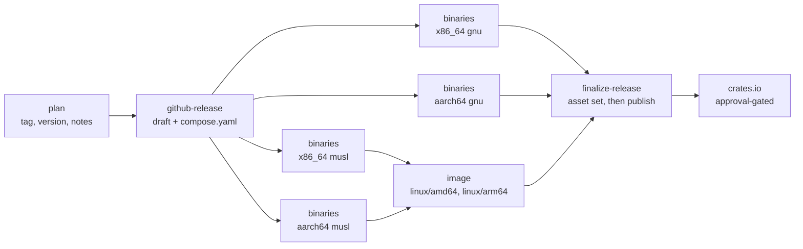

<!-- SPDX-FileCopyrightText: Ruben Talstra -->
<!-- SPDX-License-Identifier: BUSL-1.1 -->

# Cutting a release

A milestone is a delivery promise, and a release is cut when its milestone
reaches zero open issues. This page is the checklist the cut follows, in order,
and the record of what a published release is and is not protected against.

No specification governs this; it is FerroBRIDGE's own design. The lane it
describes is `.github/workflows/release.yml`, and the discipline every workflow
here obeys is `.claude/rules/ci-cd.md`.

## What the lane does

`release.yml` is dormant until a `v*` tag is pushed. It does not run on a push
to `main`, on a pull request, or in a merge group. `workflow_dispatch` re-runs
it for a tag that already exists and has to be dispatched at that tag.



- **plan** validates the tag shape, refuses a dispatch that is not at the tag
  it names, checks the tag against every file that declares the product
  version, and extracts the `## [X.Y.Z]` section of `CHANGELOG.md` as the
  release notes. A missing or empty section fails the release, so a cut can
  never ship with notes generated from the commit range standing in for the
  changelog. It also emits the target matrix, which the build jobs and the
  asset check both read, so the two cannot drift apart.
- **github-release** creates the release as a draft carrying those notes and
  attaches `compose.yaml`. A draft is mutable and invisible to anyone browsing
  releases, which is the window the asset uploads need.
- **build-binaries** calls `release-build.yml` once per target, on a runner of
  the target's own architecture. There is no cross-compilation and no
  emulation.
- **build-image** calls `release-image.yml` once the musl binaries exist, and
  builds `ghcr.io/rubentalstra/ferrobridge` for `linux/amd64` and `linux/arm64`
  from them.
- **finalize-release** checks that the draft carries every asset this version
  promises, then publishes. Publishing last means a half-assembled release is
  never visible. A pre-release publishes with `--latest=false`, so it never
  becomes the repository's latest release.
- **crates** uploads the `crates/*` members to crates.io once the release is
  public, so a refused upload never leaves a release half-cut. It runs in the
  `crates-io` environment, whose required reviewer pauses it until the owner
  approves, authenticates with Trusted Publishing (OIDC, no stored token), and
  calls `scripts/release/publish-crates.sh`, which publishes each member in
  dependency order and then reads the registry back. Re-running the same leg is
  safe: a version already on the index counts as done. The between-releases
  path for the same script is `.github/workflows/publish-crates.yml`, a manual
  dispatch that is a dry run unless `publish` is set. The rules are
  `.claude/rules/crates-publishing.md`.

Concurrency is `cancel-in-progress: false`. A second tag push queues behind the
first, because a release cancelled part-way through publishing is worse than a
slow one.

## The staging layout the image build expects

`docker/Dockerfile` compiles nothing. It copies one already-built binary out of
the build context, at `dist/${TARGETOS}_${TARGETARCH}/ferrobridge`, so
`build-binaries` stages the static musl binary it produced and attested at
`dist/linux_amd64/ferrobridge` and `dist/linux_arm64/ferrobridge` before the
image lane runs `docker buildx build -f docker/Dockerfile --platform
linux/amd64,linux/arm64 .`. `.dockerignore` denies everything but `dist/`, so
nothing else reaches the builder, and `.gitignore` keeps the staged tree out of
git. The same two commands reproduce the build on a laptop from a locally
cross-compiled binary.

## Why the two build jobs are reusable workflows

`build-binaries` and `build-image` carry a `uses:` line and nothing else. That
shape is load-bearing.

SLSA v1.2 Build Level 3 requires that the secret material authenticating the
provenance is out of reach of the environment running the user-defined build
steps ([build requirements](https://slsa.dev/spec/v1.2/build-requirements)). An
`actions/attest-*` step inside an ordinary job does not meet that: every step
of a job shares one runner VM, so a build step could reach the signing
material. GitHub's documented remedy is to move the build and its attestation
into a reusable workflow, which runs on its own VM and whose steps a caller
cannot add to ([using artifact attestations and reusable workflows to achieve
SLSA v1 Build level
3](https://docs.github.com/en/actions/security-for-github-actions/using-artifact-attestations/using-artifact-attestations-and-reusable-workflows-to-achieve-slsa-v1-build-level-3)).
A job that carries `uses:` cannot also carry `steps:`, so the regression is
unrepresentable rather than merely discouraged.

The consumer-visible prize is `--signer-workflow`: the Fulcio certificate names
the reusable workflow as the signer, so a verifier can insist an artifact came
from that lane rather than from any workflow in this repository. The commands
are in `SECURITY.md`.

`contents: write`, `id-token: write` and `attestations: write` are declared on
the caller job and on the called workflow's job, because a called workflow
receives the caller's token permissions and the guide asks for the set in both
places. The image job trades `contents: write` for `contents: read` and adds
`packages: write`.

## What release-build.yml produces, per target

The four targets are `x86_64-unknown-linux-gnu`, `x86_64-unknown-linux-musl`,
`aarch64-unknown-linux-gnu` and `aarch64-unknown-linux-musl`, each built on a
runner of its own architecture. Linux only, because the deliverable is a
server.

The build restores no cache. A cache an untrusted run could poison must never
feed a release, and a cache is an input the build did not declare. The binary
is built with `cargo auditable`, which embeds the compressed dependency list in
the binary's own `.dep-v0` section, so the shipped artifact self-describes to a
scanner even when no SBOM travelled with it.

Every name below is prefixed `ferrobridge-vX.Y.Z-<target>`.

| Asset | What it is |
|---|---|
| `.tar.gz` | the stripped binary with `LICENSE`, `NOTICE` and `README.md` |
| `.tar.gz.sha256sum` | corruption detection, and not a signature |
| `.cdx.json` | the CycloneDX SBOM of the source dependency graph, spec version 1.5 |
| `.spdx.json` | the syft SBOM of the shipped binary, read from its `.dep-v0` section |
| `.tar.gz.sigstore.json` | the Sigstore bundle of the build provenance |
| `.tar.gz.sbom.sigstore.json` | the Sigstore bundle of the CycloneDX SBOM attestation |
| `.tar.gz.build-sbom.sigstore.json` | the Sigstore bundle of the syft SBOM attestation |
| `.tar.gz.intoto.jsonl` | the provenance DSSE envelope, one per line |

`compose.yaml` is attached once, by `github-release`. `finalize-release` checks
that whole set for all four targets, matched whole-line, and names every
missing file rather than publishing a short release.

Two properties of the list are deliberate. The two SBOMs answer different
questions: CycloneDX records the direct and transitive edges of the source
graph, and the syft document records what the shipped binary actually carries.
The `.sigstore.json` and `.intoto.jsonl` suffixes are what OpenSSF Scorecard's
[signed-releases
check](https://github.com/ossf/scorecard/blob/main/docs/checks.md#signed-releases)
matches, the second scoring higher than the first. The lane refuses to upload a
`.intoto.jsonl` whose `payloadType` is not `application/vnd.in-toto+json` or
whose `predicateType` is not `https://slsa.dev/provenance/v1`, rather than
attaching a file that looks like provenance and is not.

## What release-image.yml produces

The image lane takes the two musl tarballs from this run's artifacts rather
than from the draft release: an artifact is bound to the run that uploaded it,
while a release asset is whatever happens to be attached when the job reads it.
It runs `gh attestation verify --signer-workflow` on each tarball before
extracting it, so the image provenance chains to attested inputs.

It stages `dist/linux_amd64/ferrobridge` and `dist/linux_arm64/ferrobridge`,
which is what `docker/Dockerfile` copies, and builds both platforms in one
buildx build. No QEMU: emulation is what runs commands for a foreign
architecture, and that Dockerfile runs none, being a single distroless stage
that copies a binary already built for each platform ([multi-platform
builds](https://docs.docker.com/build/building/multi-platform/)).

The index is tagged with the version, and for a release that is not a
pre-release also with its major.minor and with `latest`. BuildKit's own
provenance and SBOM attestations are off, because the GitHub attestations carry
both, keyless-signed through Sigstore, while BuildKit's are unsigned
attestation manifests inside the index. Five attestations are pushed as OCI
referrers: provenance for the index, and provenance plus an SPDX SBOM for each
platform manifest. The lane then verifies its own output the way a consumer
would, so a broken attestation fails the release instead of the first
deployment.

## The pre-release rule

A tag carrying a suffix after a hyphen (`v0.0.2-rc.1`) is a pre-release, and a
bare `vX.Y.Z` is an official release. The suffix decides three things by
itself: the GitHub release is marked as a pre-release, it publishes with
`--latest=false`, and the image carries its version tag alone, without
`major.minor` and without `latest`. Nothing else in the lane changes, so a
pre-release rehearses the whole pipeline and is how a change to it is tried
before a real cut.

## Before the tag

1. **The milestone is empty.** `gh issue list --milestone vX.Y.Z --state open`
   answers nothing, or the owner calls the cut and moves the stragglers to the
   next milestone.
2. **The version moves in every file the pin matrix names:** the root
   `Cargo.toml` `[workspace.package]` `version`, `CITATION.cff`, the
   product-version row of `docs/VERSIONS.md`, and the
   `ghcr.io/rubentalstra/ferrobridge` image tag default in `compose.yaml`.
   `scripts/checks/versions.sh` fails on any file left behind, and the `plan`
   job checks the first three against the tag and refuses the release when one
   of them is missing.
3. **The changelog names the release.** `[Unreleased]` becomes the version and
   the date, with a fresh empty `[Unreleased]` above it and a new link
   reference. What sits under the version heading is what the release notes
   say, so read it as the release notes before you tag.
4. **The gates pass on the release commit.** The tier-1 set is
   `zizmor --min-severity=low .github/`, `actionlint`, `shellcheck
   --severity=style` over every tracked shell program, `hadolint` over every
   tracked Dockerfile, `scripts/checks/comment-style.sh --all`,
   `scripts/checks/versions.sh`, and `mdbook build website/book`, beside the
   Rust lanes (`docs/ci-cd.md`).
5. **A pre-release has rehearsed any change to the lane itself.** Tag
   `vX.Y.Z-rc.1`, watch the whole graph run, and read what it produced. A
   pre-release takes the same path and is never marked latest.

## The tag

The signed tag is the owner's:

```sh
git tag -s vX.Y.Z -m "vX.Y.Z" <the merged release commit>
git push origin vX.Y.Z
```

The `release-tags` ruleset requires a signature on `refs/tags/v*`, so an
unsigned tag is refused at push time. `release.yml` takes it from there.

## After the tag

1. **Read the published release.** Its notes are the changelog section, and its
   asset list is what `finalize-release` verified.
2. **Verify one asset and the image as a stranger would**, with the commands in
   `SECURITY.md`. The image lane already ran them against its own output, so
   this confirms the published release rather than the run.
3. **The GHCR package is public.** A package pushed for the first time is
   private, which hides the image from everyone and breaks a
   `docker pull`. The owner sets it public once, in the package settings.
4. **Post the board status update** with what shipped and what the next
   milestone targets (`.claude/rules/project-board.md`).

## What a published release is protected against

Two protections cover different things, and both are on.

**The release is frozen.** GitHub's repository-level immutable-releases setting
is enabled, so once a release is published its notes and its assets cannot be
edited. That is why the lane assembles a draft and publishes last: the draft is
the only window in which assets can still be attached.

**The tag is protected.** The `release-tags` ruleset is active on
`refs/tags/v*` and blocks `deletion` and `non_fast_forward` updates, and
requires signatures. A pushed `vX.Y.Z` cannot be moved to another commit and
cannot be deleted, so the commit a release names stays the commit it was cut
from.

Read the notes before you tag. Once the release publishes, the text you wrote
is the text that stands.

**The no-retag rule is ours, not the platform's.** A bad cut ships forward as a
new patch version. Never move a tag, never delete a release and recreate it,
and never edit a published release's notes to fix what the changelog got wrong;
fix the changelog and cut the next version. The lane enforces the half it can:
`github-release` refuses to reopen an already-published release for the same
tag, and fails with that message instead.

## Sources

- Available rules for rulesets:
  <https://docs.github.com/en/repositories/configuring-branches-and-merges-in-your-repository/managing-rulesets/available-rules-for-rulesets>
- Managing releases:
  <https://docs.github.com/en/repositories/releasing-projects-on-github/managing-releases-in-a-repository>
- Automatically generated release notes:
  <https://docs.github.com/en/repositories/releasing-projects-on-github/automatically-generated-release-notes>
- GitHub Actions security hardening:
  <https://docs.github.com/en/actions/security-for-github-actions/security-hardening-for-github-actions>
- Artifact attestations and reusable workflows for SLSA v1 Build level 3:
  <https://docs.github.com/en/actions/security-for-github-actions/using-artifact-attestations/using-artifact-attestations-and-reusable-workflows-to-achieve-slsa-v1-build-level-3>
- SLSA v1.2 build requirements: <https://slsa.dev/spec/v1.2/build-requirements>
- OpenSSF Scorecard checks:
  <https://github.com/ossf/scorecard/blob/main/docs/checks.md#signed-releases>
- Docker multi-platform builds:
  <https://docs.docker.com/build/building/multi-platform/>
- cargo-auditable: <https://github.com/rust-secure-code/cargo-auditable>
