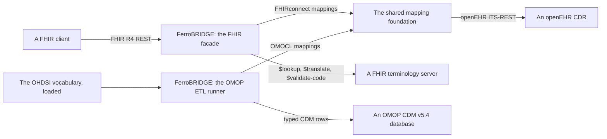

<!-- SPDX-FileCopyrightText: Ruben Talstra -->
<!-- SPDX-License-Identifier: BUSL-1.1 -->

# Architecture

FerroBRIDGE is a standalone bridge between openEHR and two interoperability
targets: HL7 FHIR through the FHIRconnect specification, and the OMOP Common
Data Model through the OMOCL specification. It runs beside an openEHR CDR and
reaches it only over the openEHR ITS-REST API, so it works against a CDR it did
not build. This page is the short tour. The design authority, with the ground
for every decision, is
[`docs/architecture.md`](https://github.com/rubentalstra/FerroBRIDGE/blob/main/docs/architecture.md)
in the repository.

<!-- toc -->

## The shape

Both sides read openEHR content the same way and write to different places. The
FHIR side answers requests one at a time and keeps no clinical data of its own.
The OMOP side runs as a batch job, queries the CDR with AQL, and writes rows.

## One foundation, two interpreters, two sinks

FHIRconnect and OMOCL are written by the same author and share one header
(`grammar`, `type`, `metadata`, `spec`, and `spec.openEhrConfig` pinning the
archetype and revision). Below that header they are different languages: one is
bidirectional and tree-shaped against FHIR paths, the other is one-directional
and flat against CDM columns. FerroBRIDGE shares the header model, the YAML
loader, the archetype-keyed mapping registry, and the RM-path model, then gives
each language its own parser, validator, and interpreter. A single intermediate
representation over both grammars would be the union of two dissimilar
languages, and it would break the first time either specification moved.

The [two mapping specifications](mapping-specifications.md) page has what each
language actually says.

## The openEHR side

Mapping paths in both languages are RM and archetype paths such as
`$archetype/data[at0001]/items[at0077]`, never FLAT paths. A path alone is not
executable: the leaf RM type and the template-specific identifiers come from the
Web Template built from the template's operational template. The order is the
operational template, then the Web Template, then path resolution, then the
composition. FerroBRIDGE resolves in that order using the published `openehr-*`
crates, which already carry the operational-template ingestion, the Web Template
builder, and the canonical-JSON and FLAT codecs.

FHIRconnect requires the context mapping's `start` entry to slot in a reusable
`COMPOSITION.<archetype>.<Resource>` mapping, and it defaults the
composition-level fields that have no FHIR counterpart: composer,
`context/start_time`, `setting`, `language`, `territory`, and `category`.
FerroBRIDGE follows those defaults and records every defaulted value in the
composition's `FEEDER_AUDIT`, so a reader can tell a mapped value from a
defaulted one.

## The FHIR side

FerroBRIDGE exposes a FHIR R4 REST facade and maps each request onto CDR
operations. It stores no clinical data. Bundles are split by context profile
URL, a resource that two mappings both need becomes a linked mapping, and
unresolved references are fetched from the sending site with cycle protection.

FHIRconnect states that it "does not focus specifically on AQL and FHIRsearch",
so FHIR search has no specification behind it here. The search design is
FerroBRIDGE's own: an AQL projection per resource type declared beside the
context mapping, executed over `POST /query/aql`, with the CapabilityStatement
naming exactly which search parameters each resource supports and an
`OperationOutcome` refusing the rest. The [FHIR facade](../integrate/fhir-facade.md)
page has the detail.

## The OMOP side

OMOP is a relational analytics schema rather than an API, so the deliverable is
rows in a populated CDM v5.4 database. The OMOP engine is a batch ETL job runner
over AQL, writing typed CDM rows into a PostgreSQL CDM database built from the
OHDSI DDLs, with the derived tables generated rather than mapped.

OMOP concept resolution is SQL over the locally loaded OHDSI vocabulary: the
CONCEPT table, `standard_concept`, the domain, and the CONCEPT_RELATIONSHIP
"Maps to" traversal. It is never a FHIR terminology operation. An unmapped code
lands as `concept_id = 0` with the source value kept, which is what the CDM
means by "no matching concept", and it is never dropped. The
[OMOP ETL](../integrate/omop-etl.md) page has the detail.

## Generated and hand-written

The OMOP CDM v5.4 row types and DDL are generated from the OHDSI
`CommonDataModel` definitions, because that model is published in
machine-readable form and a hand-transcribed copy drifts from its source with
no way to detect it. The FHIR model is a dependency: the published `fhir-types`
and `fhir-terminology` crates already carry per-version FHIR types and the
terminology operation contracts, so nothing regenerates them here. Everything
that makes FerroBRIDGE a bridge is hand-written: the mapping foundation, the two
parsers and interpreters, the ITS-REST client, the terminology client, the
facade, and the ETL runner.

## Where the specifications are silent

FerroBRIDGE labels its own decisions as its own, in the code and in these
pages. The FHIRconnect engine chapter is explicitly a set of recommendations,
and no specification governs FHIR search, identity, extension ordering, or
failure policy. Each of those is pinned as a FerroBRIDGE decision on the
[failure and identity](../operate/failure-and-identity.md) page and in the
architecture document.
